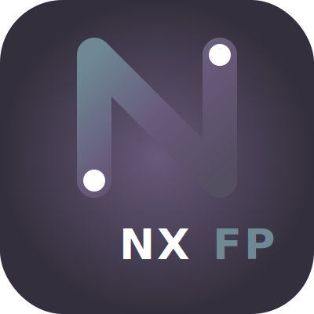

<p align="center">
  
</p>

<h1 align="center">Nexo FP</h1>

<p align="center">
  Plataforma web para gestionar la formación en empresas de la Formación Profesional
</p>

---

Nexo FP es una aplicación web desarrollada con [Symfony] que permite organizar y gestionar la
la **Fase de Formación en Empresa u Organismo Equiparado**. Centraliza la
información de estudiantes, empresas, puestos formativos y tutores, y permite llevar el seguimiento
del proceso de asignación desde que se crea un puesto hasta que se registra en Séneca.

La aplicación se ha diseñado para ser intuitiva y fácil de usar, con un enfoque en la eficiencia
y la reducción de errores administrativos. Permite generar informes detallados en PDF y facilita la
comunicación entre el centro educativo y las empresas.

Forma parte del proyecto de innovación educativa REASOL (PIN-219/23 y PIN-354/24) financiado por la Consejería de 
Desarrollo Educativo y Formación Profesional de la Junta de Andalucía.

---

## Secciones de la aplicación

### Inicio

Panel resumen del curso académico activo. Muestra el número de estancias abiertas, puestos
formativos creados, estudiantes inscritos y el estado general de las asignaciones.

### Estancias

Una **estancia** agrupa un conjunto de puestos formativos de una misma enseñanza dentro de un
periodo concreto (por ejemplo, "DAW - 2º curso, marzo-mayo 2027").

Desde esta sección se puede:

- Crear y editar estancias con nombre, enseñanza y fechas de inicio y fin.
- Añadir, editar y eliminar **puestos formativos** dentro de cada estancia.
- Inscribir o retirar estudiantes de la estancia.
- Descargar un **informe PDF** con el detalle de todos los puestos y sus asignaciones.

> Un docente solo ve en el listado las estancias de las enseñanzas en las que tiene algún rol
> (administrador/a de centro, coordinador/a de FP dual, jefe/a de departamento de familia profesional,
> tutor/a o docente de un grupo, o docente de enlace del centro). Las estancias de otras enseñanzas
> no aparecen ni son accesibles.

Cada puesto formativo registra:

| Campo                   | Descripción                                                                    |
|-------------------------|--------------------------------------------------------------------------------|
| Centro de trabajo       | Sede de la empresa donde se realizará la estancia                              |
| Estudiante              | Alumno/a asignado/a al puesto                                                  |
| Tutor/a dual docente    | Profesor/a responsable del seguimiento académico                               |
| Tutor/a dual de empresa | Empleado/a responsable en la empresa                                           |
| Nivel                   | Curso(s) de la enseñanza al que corresponde el puesto ("1º", "2º" o "1º y 2º") |
| Fechas                  | Inicio y fin propios del puesto (pueden diferir de la estancia)                |
| Estado                  | `Borrador`, `Pendiente de Séneca` o `Registrado en Séneca`                     |
| Firmado                 | Indica si el convenio está firmado                                             |

### Empresas

Directorio de empresas colaboradoras del centro. Permite registrar y gestionar:

- Datos de la empresa: nombre, CIF/NIF, localidad y circunstancias excepcionales.
- **Centros de trabajo** (sedes o filiales) donde los estudiantes realizarán su formación.
- **Empleados** de la empresa que pueden actuar como tutores de empresa.
- **Docentes de enlace** asignados a cada empresa.

> Esta sección solo es visible para administradores/as de centro, coordinadores/as de FP dual,
> jefes/as de departamento de familia profesional y docentes de enlace.

### Centro Educativo

Aquí se implementa la gestión interna del centro. Reúne en un único espacio:

- **Docentes del curso:** alta, baja e importación del personal adscrito al curso activo.
- **Estudiantes:** alta, edición, baja e importación masiva desde CSV.
- **Oferta formativa:** estructura jerárquica completa:
  - Familias profesionales
  - Enseñanzas (ciclos formativos)
  - Niveles (cursos dentro de cada enseñanza)
  - Grupos (con asignación de tutor y docentes)
- **Cursos académicos:** crear y activar cursos del centro.

### Administración

Sección exclusiva para administradores globales. Permite:

- Gestionar todos los **docentes** del sistema (alta, baja, activación, asignación de rol de administrador,
  tipo de autenticación).
- Gestionar **centros educativos**: crearlos, asignarles el equipo directivo y gestionar sus cursos académicos.

---

## Roles de los docentes

Todos los usuarios del sistema son docentes (`Teacher`). El nivel de acceso depende de los roles
y responsabilidades asignados:

### Administrador global (`ROLE_ADMIN`)

Acceso completo a la aplicación, incluida la sección **Administración**. Puede gestionar todos los
docentes y centros del sistema, y suplantar la identidad de cualquier usuario para soporte.

Se crea al menos uno durante el primer arranque (`admin` / `admin`). Se pueden crear más con
`bin/console app:create-admin`.

### Administrador de centro

Docente designado como responsable de un centro educativo concreto. Tiene acceso completo a ese
centro: puede gestionar la oferta formativa, el alumnado, los docentes del curso, las empresas y
las estancias. No tiene acceso a la sección de administración global.

### Docente

Rol base de todos los usuarios autenticados. Accede al panel de inicio y a su propio perfil.
Si está asignado a un grupo como tutor o docente de ese grupo, puede **ver** las estancias de
la enseñanza correspondiente y consultar sus puestos formativos, pero no puede modificarlas.

### Coordinador/a de FP dual

Docente asignado como coordinador/a de una o varias enseñanzas. Tiene acceso a la sección
**Empresas** (puede ver y editar todas las empresas del centro) y puede crear, modificar y
eliminar estancias de las enseñanzas que coordina, así como gestionar sus puestos formativos
y las asignaciones de estudiantes y tutores. Al crear una nueva estancia, solo puede seleccionar
enseñanzas de las que es coordinador/a.

### Docente de enlace

Docente asignado/a a una o varias empresas del centro. Puede acceder a la sección **Empresas** y
editar los datos de aquellas empresas de las que es enlace: centros de trabajo, empleados y
docentes de enlace. Además, puede ver y gestionar todas las estancias del centro,
independientemente de la enseñanza a la que pertenezcan.

### Jefe/a de departamento de familia profesional

Docente designado/a como jefe/a de departamento de una familia profesional. Tiene acceso a la
sección **Empresas** (puede ver y editar cualquier empresa del centro) y puede ver y gestionar
—editar, gestionar puestos y eliminar— las estancias de las enseñanzas pertenecientes a su
familia profesional.

---

## Flujo de trabajo

El proceso habitual en Nexo FP sigue estas fases, desde la configuración inicial del curso hasta
el cierre de las estancias:

### 1 — Configurar el curso

El administrador de centro accede a **Centro Educativo** y prepara el curso activo:

1. Crea o activa el **curso académico**.
2. Estructura la **oferta formativa**: familias → enseñanzas → niveles → grupos.
3. Asigna **tutores y docentes** a cada grupo.
4. Importa o da de alta a los **estudiantes** y los distribuye en sus grupos.
5. Añade al resto de **docentes del curso** para que puedan acceder a la plataforma.

### 2 — Registrar empresas y centros de trabajo

Antes de crear puestos, el personal con acceso a **Empresas** registra:

1. Las **empresas** colaboradoras con sus datos básicos.
2. Los **centros de trabajo** (sedes) de cada empresa.
3. Los **empleados** que actuarán como tutores de empresa.
4. Los **docentes de enlace** asignados a cada empresa.

### 3 — Crear estancias y puestos formativos

Con la oferta formativa y las empresas preparadas, los docentes con permisos crean las estancias:

1. En **Estancias → Nueva estancia**, se selecciona la enseñanza y se define el nombre y las
   fechas.
2. Dentro de la estancia, se añaden los **puestos formativos**: para cada puesto se indica el
   centro de trabajo y el nivel al que corresponde.
3. Se inscriben los **estudiantes** en la estancia para que puedan asignarse a los puestos.

### 4 — Asignar estudiantes y tutores

Una vez creados los puestos, se completa cada uno con su asignación:

1. Se selecciona el **estudiante** que ocupará el puesto.
2. Se designa el **tutor/a docente** (responsable académico).
3. Se designa el **tutor/a de empresa** (responsable en la empresa).
4. Se ajustan las fechas del puesto si difieren de las de la estancia.

Mientras el puesto está en estado **Borrador**, todos los campos son editables.

### 5 — Tramitar en Séneca

Cuando una asignación está lista para enviarse al sistema regional:

1. El estado del puesto pasa a **Pendiente de Séneca**.
2. Una vez confirmada la recepción en Séneca, se marca como **Registrado en Séneca** y el
   convenio se indica como firmado.
3. Los puestos en estado `Registrado` quedan bloqueados para evitar modificaciones accidentales.

### 6 — Generar informes

En cualquier momento se puede descargar el **informe PDF** de cada estancia con el detalle
completo de todos los puestos, estudiantes, tutores y fechas.

---

## Tabla de permisos

La siguiente tabla resume qué puede hacer cada perfil en cada sección de la aplicación. Los roles son acumulativos: un docente con varios roles tiene la unión de sus permisos.

| Abrev. | Rol |
|--------|-----|
| **ADM** | Administrador/a global |
| **ED** | Administrador/a de centro |
| **JFP** | Jefe/a de departamento de familia profesional |
| **CFD** | Coordinador/a de FP dual |
| **DE** | Docente de enlace |
| **TG** | Tutor/a de grupo / Docente de grupo |
| **D** | Docente (sin rol específico en el centro) |

### Centro educativo

| Acción | ADM | ED | JFP | CFD | DE | TG | D |
|--------|:---:|:--:|:---:|:---:|:--:|:--:|:-:|
| Acceder a la sección | ✅ | ✅ | ❌ | ❌ | ❌ | ❌ | ❌ |
| Gestionar docentes del curso | ✅ | ✅ | ❌ | ❌ | ❌ | ❌ | ❌ |
| Gestionar estudiantes | ✅ | ✅ | ❌ | ❌ | ❌ | ❌ | ❌ |
| Gestionar oferta formativa¹ | ✅ | ✅ | ❌ | ❌ | ❌ | ❌ | ❌ |
| Crear y activar cursos académicos | ✅ | ❌ | ❌ | ❌ | ❌ | ❌ | ❌ |

¹ Familias profesionales, enseñanzas, niveles y grupos.

> **Nota sobre el docente de enlace (DE):** puede ver las estancias que tienen puestos formativos de sus empresas asignadas, añadir nuevos puestos de sus empresas a esas estancias, y editar o eliminar únicamente los puestos de sus empresas **que no tengan estudiante asignado**. No puede crear estancias, editarlas en conjunto ni gestionar la inscripción de estudiantes.
>
> **Nota sobre el docente base (D):** puede ver las estancias de las enseñanzas en las que está asignado a algún grupo (como tutor o docente). Si no tiene ningún grupo asignado, no accede a ninguna estancia.

### Estancias

| Acción | ADM | ED | JFP | CFD | DE | TG | D |
|--------|:---:|:--:|:---:|:---:|:--:|:--:|:-:|
| Ver estancias | ✅ | ✅ | Su familia prof. | Sus enseñanzas | Sus empresas³ | Sus enseñanzas | Sus enseñanzas |
| Crear estancia | ✅ | ✅ | ❌ | Sus enseñanzas | ❌ | ❌ | ❌ |
| Editar / eliminar estancia | ✅ | ✅ | Su familia prof. | Sus enseñanzas | ❌ | ❌ | ❌ |
| Añadir puestos formativos | ✅ | ✅ | Su familia prof. | Sus enseñanzas | Sus empresas³⁴ | ❌ | ❌ |
| Editar / eliminar puestos formativos | ✅ | ✅ | Su familia prof. | Sus enseñanzas | Sus empresas³⁴ | ❌ | ❌ |
| Inscribir / retirar estudiantes | ✅ | ✅ | Su familia prof. | Sus enseñanzas | ❌ | ❌ | ❌ |
| Descargar informe PDF | ✅ | ✅ | Su familia prof. | Sus enseñanzas | Sus empresas³ | Sus enseñanzas | Sus enseñanzas |

### Empresas

| Acción | ADM | ED | JFP | CFD | DE | TG | D |
|--------|:---:|:--:|:---:|:---:|:--:|:--:|:-:|
| Acceder a la sección | ✅ | ✅ | ✅ | ✅ | ✅ | ❌ | ❌ |
| Ver y buscar empresas | ✅ | ✅ | ✅ | ✅ | ✅ | ❌ | ❌ |
| Crear empresa | ✅ | ✅ | ✅ | ✅ | ✅ | ❌ | ❌ |
| Editar empresa² | ✅ | ✅ | ✅ | ✅ | Sus empresas | ❌ | ❌ |
| Eliminar empresa | ✅ | ✅ | ❌ | ❌ | ❌ | ❌ | ❌ |

² Incluye centros de trabajo, empleados y docentes de enlace asignados.
³ Solo estancias/puestos donde intervienen sus empresas asignadas.
⁴ Solo puestos sin estudiante asignado. Los puestos con estudiante asignado no pueden ser modificados ni eliminados por el docente de enlace.

### Administración global

| Acción | ADM | ED | JFP | CFD | DE | TG | D |
|--------|:---:|:--:|:---:|:---:|:--:|:--:|:-:|
| Acceder a la sección | ✅ | ❌ | ❌ | ❌ | ❌ | ❌ | ❌ |
| Gestionar docentes del sistema | ✅ | ❌ | ❌ | ❌ | ❌ | ❌ | ❌ |
| Gestionar centros educativos | ✅ | ❌ | ❌ | ❌ | ❌ | ❌ | ❌ |

### Otras acciones y permisos generales

| Acción | ADM | ED | JFP | CFD | DE | TG | D |
|--------|:---:|:--:|:---:|:---:|:--:|:--:|:-:|
| Acceder a la plataforma | ✅ | ✅ | ✅ | ✅ | ✅ | ✅ | ✅ |
| Ver panel de inicio | ✅ | ✅ | ✅ | ✅ | ✅ | ✅ | ✅ |
| Gestionar el propio perfil | ✅ | ✅ | ✅ | ✅ | ✅ | ✅ | ✅ |
| Acceder como otro usuario (suplantación) | ✅ | ❌ | ❌ | ❌ | ❌ | ❌ | ❌ |

---

## Comandos de consola

La aplicación incluye tres comandos de consola para la administración inicial del sistema. Se ejecutan con `php bin/console <comando>` en desarrollo, o con el binario nativo (`nexo-fp php-cli bin/console <comando>` en Linux/macOS, `nexo-fp.exe php-cli bin/console <comando>` en Windows).

---

### `app:setup`

Inicializa la aplicación con datos de ejemplo si la base de datos está vacía. Si ya existe algún docente registrado, el comando no hace nada y muestra un aviso.

**Cuándo usarlo:** primera puesta en marcha en un entorno de desarrollo o pruebas para disponer de un usuario `admin`/`admin` y un centro educativo de ejemplo listos para usar.

```bash
php bin/console app:setup
```

No acepta argumentos ni opciones. Es idempotente: se puede ejecutar varias veces sin riesgo.

---

### `app:create-educational-centre`

Crea un nuevo centro educativo y su primer curso académico (el curso actual, calculado automáticamente).

```bash
php bin/console app:create-educational-centre [<código>] [<nombre>] [<ciudad>]
```

| Argumento | Descripción                               | Requisito |
|-----------|-------------------------------------------|-----------|
| `código`  | Código del centro (p. ej. `23700281`)     | Se solicita de forma interactiva si no se indica |
| `nombre`  | Nombre del centro (p. ej. `IES Oretania`) | Se solicita de forma interactiva si no se indica |
| `ciudad`  | Ciudad del centro (p. ej. `Linares`)      | Se solicita de forma interactiva si no se indica |

El comando falla si ya existe un centro con el mismo código.

---

### `app:create-admin`

Crea un docente con privilegios de administrador global.

```bash
php bin/console app:create-admin <nombre_de_usuario> [<contraseña>]
```

| Argumento          | Descripción                        | Requisito |
|--------------------|------------------------------------|-----------|
| `nombre_de_usuario` | Nombre de usuario para el login   | **Obligatorio** |
| `contraseña`        | Contraseña en texto plano          | Se solicita de forma oculta e interactiva si no se indica |

El comando falla si el nombre de usuario ya está registrado. La contraseña se almacena siempre hasheada.

---

## Requisitos

Según el modo de despliegue elegido, los requisitos son distintos:

| Modo | Requisitos |
|------|-----------|
| Docker | Docker Engine 24+ y Docker Compose v2 |
| Binario nativo | Sin requisitos adicionales (todo incluido) |
| Desarrollo local | PHP 8.4+, Composer, PostgreSQL 16+ o SQLite |

---

## Despliegue con Docker

Este es el modo recomendado para entornos de producción. La imagen incluye [FrankenPHP] como
servidor de aplicaciones y usa [PostgreSQL] 16 como base de datos.

### Preparación

Copia el fichero de ejemplo y edita los valores:

```bash
cp .env.example .env
```

Los campos obligatorios son:

- **`APP_SECRET`** — clave aleatoria de 64 caracteres hexadecimales. Genera una con:
  ```bash
  php -r 'echo bin2hex(random_bytes(32));'
  ```
- **`DB_PASSWORD`** — contraseña de la base de datos PostgreSQL.

### Arranque

```bash
docker compose up -d
```

La primera vez que se inicia, el contenedor realiza automáticamente:

1. Ejecuta las migraciones de base de datos.
2. Crea el usuario administrador inicial (`admin` / `admin`) y el centro de prueba `IES Test`.
3. Precalienta la caché de Symfony.

La aplicación queda disponible en `http://localhost` (puerto 80 por defecto).

### HTTPS con Let's Encrypt

Para habilitar HTTPS automático, edita `.env` con tu dominio real:

```dotenv
SERVER_NAME=nexo.tudominio.es
DEFAULT_URI=https://nexo.tudominio.es
HTTP_PORT=80
HTTPS_PORT=443
```

FrankenPHP (Caddy) gestionará el certificado TLS sin configuración adicional.

### Datos persistentes

Los datos se almacenan en el directorio `./data/` del proyecto:

- `./data/postgres/` — base de datos PostgreSQL.
- `./data/var/` — caché, logs y sesiones de Symfony.

### Actualización

```bash
docker compose pull   # o: docker compose build
docker compose up -d
```

Las migraciones se aplican automáticamente en cada arranque.

### Comandos útiles

```bash
# Ver logs en tiempo real
docker compose logs -f app

# Abrir una shell en el contenedor
docker compose exec app sh

# Crear un centro educativo adicional
docker compose exec app php bin/console app:create-educational-centre

# Crear un administrador adicional
docker compose exec app php bin/console app:create-admin
```

---

## Ejecución como binario nativo

El modo binario nativo está pensado para instalaciones sencillas sin Docker. Incluye un ejecutable
de [FrankenPHP] que embebe el servidor web y PHP, y usa [SQLite] como base de datos, por lo que no
necesita ningún software adicional instalado en el sistema.

### Descarga

Descarga el paquete correspondiente a tu sistema operativo desde la página de releases del proyecto
y descomprímelo. El paquete contiene:

```
nexo-fp/
├── app/            ← código de la aplicación
├── data/           ← generado automáticamente (BD, caché, secreto)
├── frankenphp      ← ejecutable (frankenphp.exe en Windows)
├── Caddyfile       ← configuración del servidor web
├── start.sh        ← script de arranque (Linux / macOS)
├── start.bat       ← script de arranque (Windows CMD)
└── start.ps1       ← script de arranque (Windows PowerShell)
```

### Primer arranque

**Linux / macOS:**

```bash
chmod +x frankenphp start.sh
./start.sh
```

**Windows (CMD):**

```bat
start.bat
```

**Windows (PowerShell):**

```powershell
.\start.ps1
```

Se puede especificar un puerto distinto al predeterminado (8080):

```bash
./start.sh 9000          # Linux / macOS
start.bat 9000           # Windows CMD
.\start.ps1 -Port 9000   # Windows PowerShell
```

La primera vez que se inicia, el script realiza automáticamente:

1. Genera un `APP_SECRET` aleatorio y lo guarda en `data/.secret`.
2. Crea la base de datos SQLite en `data/nexo-fp.db`.
3. Ejecuta las migraciones.
4. Crea el usuario administrador inicial (`admin` / `admin`) y el centro de prueba `IES Test`.
5. Precalienta la caché de Symfony.

La aplicación queda disponible en `http://localhost:8080` (o el puerto indicado).

### Datos persistentes

Todo lo generado en tiempo de ejecución se guarda en el directorio `data/` dentro del paquete.
Para hacer una copia de seguridad basta con copiar ese directorio.

### macOS: aviso de Gatekeeper

La primera vez que se ejecuta en macOS, el sistema puede bloquear el binario por no estar firmado.
El script `start.sh` elimina la cuarentena automáticamente, pero si el problema persiste ejecuta:

```bash
xattr -d com.apple.quarantine frankenphp
```

### Variables de entorno opcionales

Tanto en Linux/macOS como en Windows se pueden ajustar antes de lanzar el script:

| Variable | Descripción | Valor por defecto |
|----------|-------------|-------------------|
| `PORT` | Puerto de escucha | `8080` |
| `APP_PAGE_SIZE` | Elementos por página | `20` |
| `APP_EXTERNAL_ENABLED` | Activar autenticación iSéneca | `true` |
| `APP_EXTERNAL_URL` | URL del servicio iSéneca | *(URL oficial)* |
| `APP_EXTERNAL_URL_FORCE_SECURITY` | Verificar certificado TLS de iSéneca | `true` |

---

## Licencia

Esta aplicación se ofrece bajo licencia [AGPL versión 3].

[Symfony]: http://symfony.com/
[Composer]: http://getcomposer.org
[FrankenPHP]: https://frankenphp.dev
[PostgreSQL]: https://www.postgresql.org
[SQLite]: https://www.sqlite.org
[AGPL versión 3]: http://www.gnu.org/licenses/agpl.html
