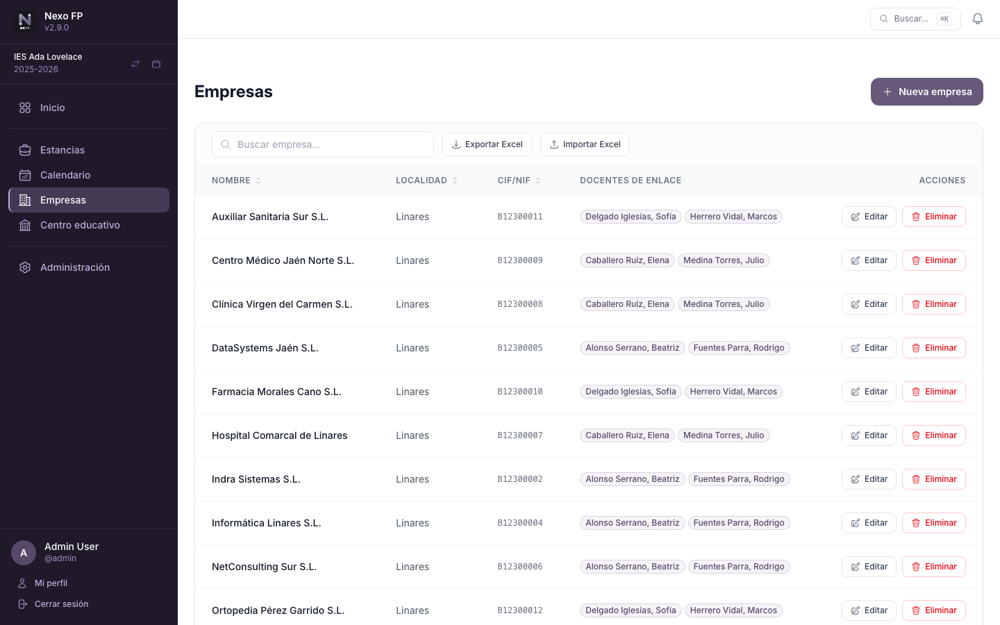
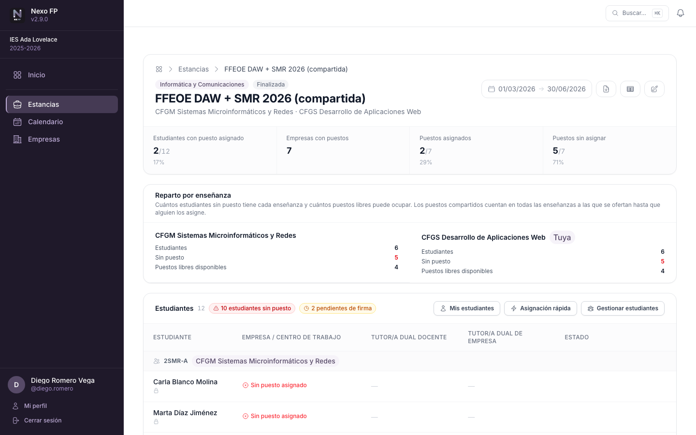
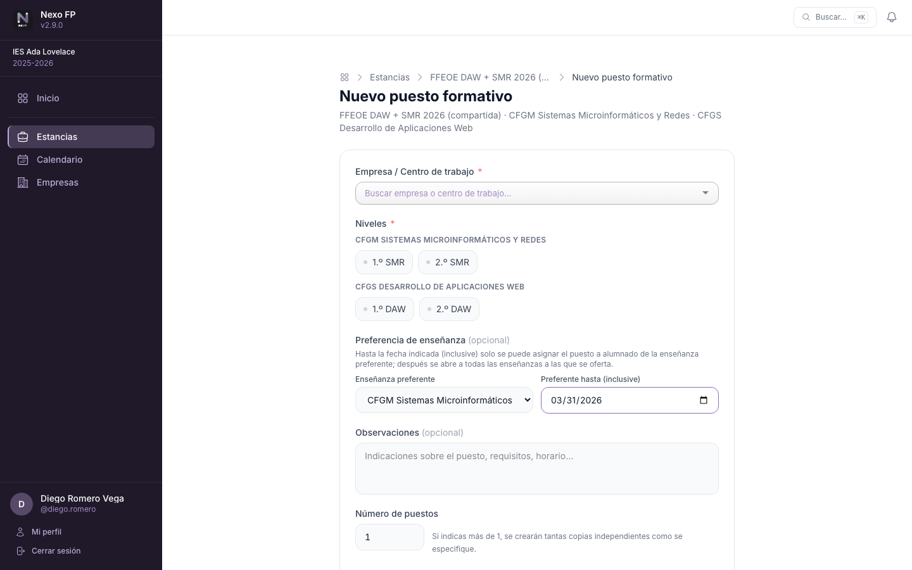
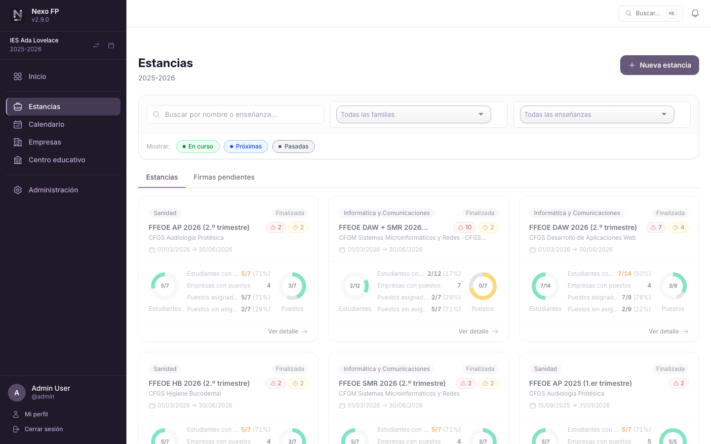

# Flujo de trabajo

El proceso habitual en Nexo FP sigue estas fases, desde la configuración inicial del curso hasta el
cierre de las estancias. Cada fase indica **quién hace qué**.

## 1 — Configurar el curso

El administrador de centro accede a **Centro Educativo** y prepara el curso activo (detallado en
[Primeros pasos](02-primeros-pasos.md)):

1. Crea o activa el **curso académico**.
2. Estructura la **oferta formativa**: familias → enseñanzas → niveles → grupos.
3. Asigna **tutores y docentes** a cada grupo.
4. Importa o da de alta a los **estudiantes** y los distribuye en sus grupos.
5. Añade al resto de **docentes del curso** para que puedan acceder a la plataforma.

## 2 — Registrar empresas y centros de trabajo

Antes de crear puestos, el personal con acceso a **Empresas** registra:

1. Las **empresas** colaboradoras con sus datos básicos (nombre, CIF/NIF, localidad).
2. Los **centros de trabajo** (sedes) de cada empresa.
3. Los **empleados** que actuarán como tutores de empresa.
4. Los **docentes de enlace** asignados a cada empresa.



## 3 — Crear estancias y puestos formativos

Una **estancia** agrupa un conjunto de puestos formativos de una o varias enseñanzas dentro de un periodo
concreto (por ejemplo, «DAW y DAM - 2.º curso, marzo-mayo 2027»).

1. En **Estancias → Nueva estancia**, se seleccionan las **enseñanzas** (una o varias) y se define el nombre
   y las fechas.
2. Dentro de la estancia, se añaden los **puestos formativos**: para cada puesto se indica el centro de
   trabajo y los **niveles** a los que se oferta, que pueden ser de cualquiera de las enseñanzas de la
   estancia (así una empresa puede ofrecer un mismo puesto a alumnado de DAW y de DAM).
3. Cada coordinación inscribe a sus **estudiantes** en la estancia para que puedan asignarse a los puestos.

### Estancias con varias enseñanzas



- **Cada coordinación gestiona a su alumnado**: solo puede inscribirlo y asignarle puesto a él. El
  alumnado de las demás enseñanzas se ve (con un candado y sin NIE) pero no se puede modificar; el botón
  **Mis estudiantes** filtra la lista al propio.
- **Un puesto, un estudiante**: cuando una coordinación asigna un puesto compartido, deja de estar
  disponible para cualquier otro estudiante, sea o no de la misma enseñanza. Si dos coordinaciones lo
  intentan a la vez, la segunda recibe un aviso con el nombre de quien se ha adelantado y no se pierde
  nada. Las coordinaciones de las demás enseñanzas a las que se ofertaba el puesto reciben un correo.
- **Preferencia temporal**: al crear o editar un puesto compartido se puede indicar una **enseñanza
  preferente** y una fecha límite (inclusive). Hasta esa fecha el puesto solo se puede asignar a alumnado
  de esa enseñanza; después se abre a todas las demás a las que se oferta.
- **Reparto por enseñanza**: un panel resume, para cada enseñanza, cuántos estudiantes tiene, cuántos sin
  puesto y cuántos puestos libres puede ocupar (separando los reservados a otra enseñanza).
- Solo se puede asignar un puesto a un estudiante si está ofertado a su nivel.



- Una enseñanza con alumnado inscrito o con puestos ofertados no se puede quitar de la estancia.



!!! info "Estancias solapadas"
    Una misma enseñanza puede tener **varias estancias que se solapen** en el tiempo: no todos los grupos
    realizan la fase de formación a la vez. Es una situación legítima y la aplicación no la impide.

## 4 — Asignar estudiantes y tutores

Una vez creados los puestos, se completa cada uno con su asignación:

1. Se selecciona el **estudiante** que ocupará el puesto (de entre los de la propia coordinación).
2. Se designa el **tutor/a dual docente** (responsable académico).
3. Se designa el **tutor/a dual de empresa** (responsable en la empresa).
4. Se ajustan las fechas del puesto si difieren de las de la estancia.

Mientras el puesto está en estado **Borrador**, todos los campos son editables. El modo de **asignación
rápida** muestra los selectores en todas las filas a la vez para agilizar el reparto.

## 5 — Estados del puesto y tramitación en Séneca

Cada puesto formativo recorre un ciclo de vida:

```
Borrador → Pendiente de Séneca → Registrado en Séneca
```

1. Para salir de **Borrador** hay que asignar **ambos tutores** (docente y de empresa).
2. Cuando la asignación está lista, el estado pasa a **Pendiente de Séneca**.
3. Una vez confirmada la recepción en Séneca, se marca como **Registrado en Séneca** y el convenio se
   registra como firmado. La casilla **Firmado** solo se habilita en este estado.
4. Los puestos en estado **Registrado** quedan bloqueados para evitar modificaciones accidentales; se
   puede volver a *Borrador* para corregir datos.

!!! tip "Ten en cuenta"
    La aplicación bloquea las transiciones inválidas y avisa de lo que falta en cada momento.

## 6 — Generar informes

En cualquier momento se puede descargar el **informe PDF** de cada estancia con el detalle completo de
todos los puestos, estudiantes, tutores y fechas, o exportar los datos a **Excel**.
