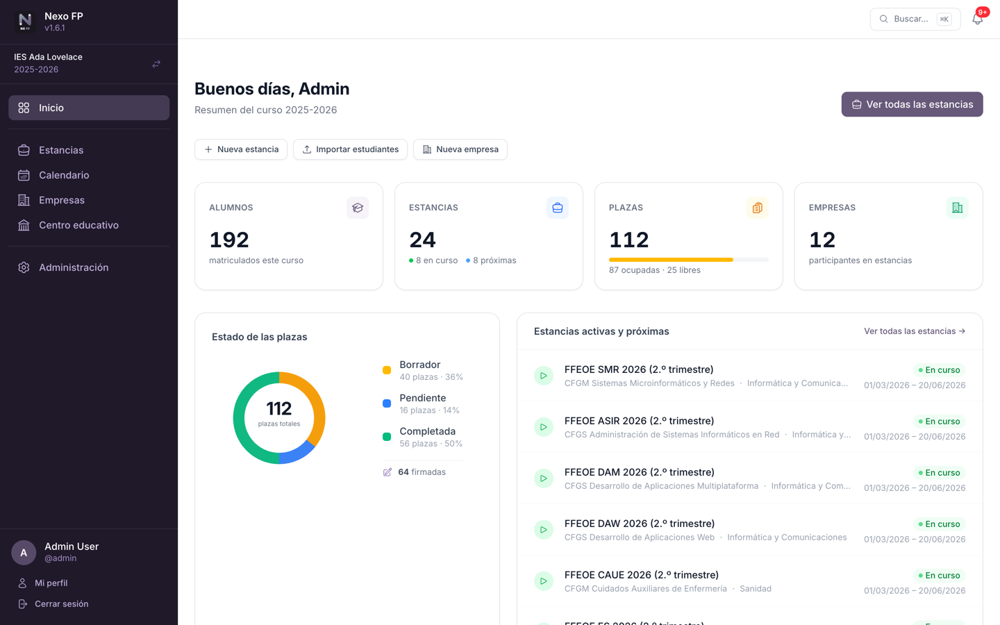
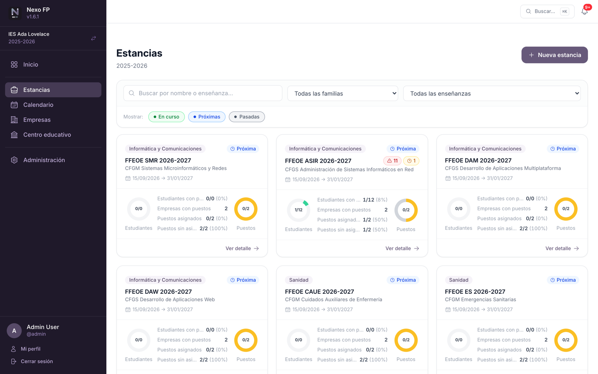
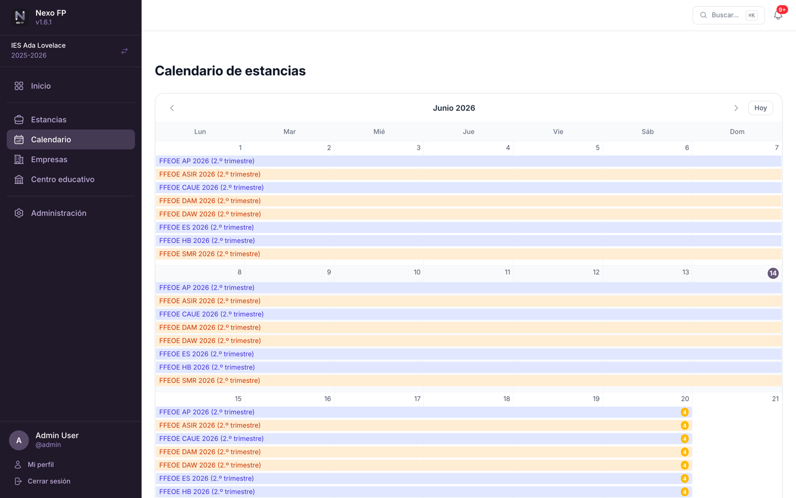
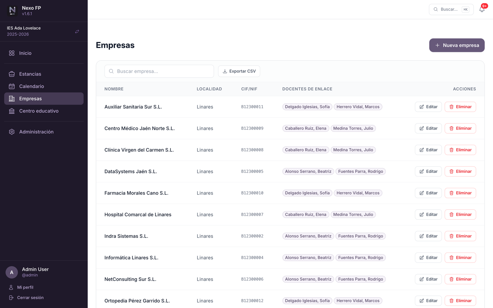
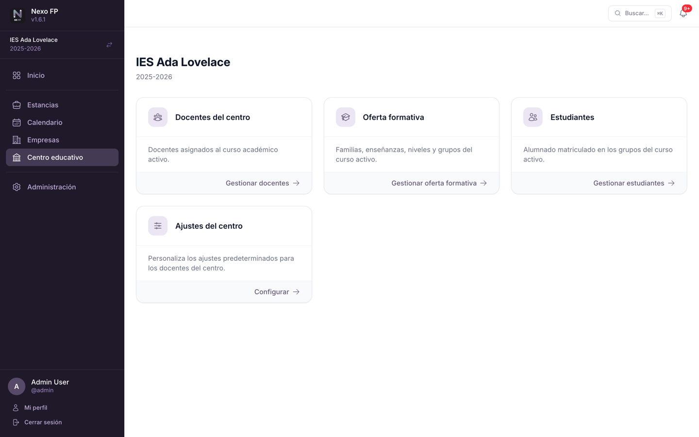
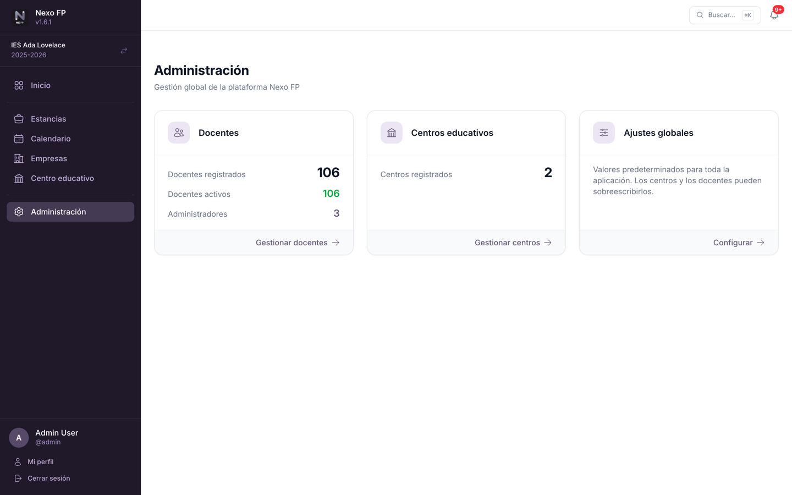

# Secciones de la aplicación

Referencia de cada pantalla de Nexo FP y de lo que permite hacer.

## Inicio

Panel resumen del curso académico activo. Muestra el número de estancias abiertas, puestos formativos
creados, estudiantes inscritos y el estado general de las asignaciones. Cada tarjeta de métricas enlaza
con su sección correspondiente y, según los permisos del docente, se muestran **accesos rápidos** para
crear una estancia, importar estudiantes o registrar una empresa.

Al final del panel, el bloque **Pendientes** lista las estancias activas que requieren atención:
estudiantes sin puesto asignado, puestos libres, puestos sin tutor/a dual docente o de empresa, y puestos
finalizados sin firmar. Cada estancia enlaza directamente con su página de detalle.

La cabecera incluye una **campana de notificaciones** que muestra en tiempo real las tareas pendientes
del docente: firmas próximas a vencer, puestos sin estudiante, sin tutor académico o sin mentor de
empresa, y estudiantes sin puesto asignado.

La **búsqueda global** (⌘K / Ctrl+K) permite localizar estancias, empresas, estudiantes y docentes desde
cualquier página, aplicando los mismos permisos que la barra lateral. Los resultados aparecen en tiempo
real con navegación por teclado (↑ ↓ Enter) y cierre con Esc.

## Estancias

Una **estancia** agrupa un conjunto de puestos formativos de una misma enseñanza dentro de un periodo
concreto. Desde esta sección se puede:

- Crear y editar estancias con nombre, enseñanza y fechas de inicio y fin.
- Añadir, editar y eliminar **puestos formativos** dentro de cada estancia.
- Inscribir o retirar estudiantes de la estancia.
- Asignar estudiantes y tutores directamente desde el detalle, con un modo de **asignación rápida** que
  muestra los selectores en todas las filas a la vez.
- Descargar un **informe PDF** con el detalle de todos los puestos y sus asignaciones.
- Exportar los puestos de la estancia a **CSV** (compatible con Excel) con estudiante, empresa, centro de
  trabajo, tutorías y estado.
- Los **filtros** (búsqueda, familia profesional, enseñanza y período) se recuerdan por centro en el
  navegador y se restauran automáticamente al volver al listado.

> Un docente solo ve en el listado las estancias de las enseñanzas en las que tiene algún rol. Las
> estancias de otras enseñanzas no aparecen ni son accesibles (consulta
> [Roles y permisos](03-roles-y-permisos.md)).

> Los tutores/as y docentes de grupo ven el detalle de la estancia y los puestos formativos de sus
> estudiantes, pero **no** el bloque de **puestos sin asignar**. Estos solo son visibles para quienes
> gestionan la estancia (administración, coordinación o jefatura de departamento) y para los docentes de
> enlace de las empresas implicadas. La misma regla se aplica al informe PDF y a la exportación CSV.

Cada puesto formativo registra:

| Campo | Descripción |
|-------|-------------|
| Centro de trabajo | Sede de la empresa donde se realizará la estancia |
| Estudiante | Alumno/a asignado/a al puesto |
| Tutor/a dual docente | Profesor/a responsable del seguimiento académico |
| Tutor/a dual de empresa | Empleado/a responsable en la empresa |
| Nivel | Curso(s) de la enseñanza al que corresponde el puesto («1.º», «2.º» o «1.º y 2.º») |
| Fechas | Inicio y fin propios del puesto (pueden diferir de la estancia) |
| Estado | `Borrador`, `Pendiente de Séneca` o `Registrado en Séneca` |
| Firmado | Indica si el convenio está firmado |

## Calendario

Vista mensual de todas las estancias visibles para el docente. Muestra cada estancia como una barra de
color (un color por familia profesional) con gestión automática de carriles para estancias solapadas. Un
badge ámbar al final de cada barra indica el número de puestos pendientes de firma.

La navegación mes a mes se realiza sin recarga completa de página. Cada barra enlaza directamente con el
detalle de la estancia.

## Empresas

Directorio de empresas colaboradoras del centro. Permite registrar y gestionar:

- Datos de la empresa: nombre, CIF/NIF, localidad y circunstancias excepcionales.
- **Centros de trabajo** (sedes o filiales) donde los estudiantes realizarán su formación.
- **Empleados** de la empresa que pueden actuar como tutores de empresa.
- **Docentes de enlace** asignados a cada empresa.

El listado de empresas puede exportarse a **CSV** respetando el filtro de búsqueda activo.

> Esta sección solo es visible para administradores/as de centro, coordinadores/as de FP dual, jefes/as
> de departamento de familia profesional y docentes de enlace.

## Centro Educativo

Gestión interna del centro. Reúne en un único espacio:

- **Docentes del curso:** alta, baja e importación del personal adscrito al curso activo.
- **Estudiantes:** alta, edición, baja, importación masiva desde CSV y exportación a CSV respetando los
  filtros de búsqueda y grupo activos.
- **Oferta formativa:** estructura jerárquica completa (familias profesionales → enseñanzas → niveles →
  grupos, con asignación de tutor y docentes a cada grupo).
- **Cursos académicos:** crear y activar cursos del centro.

## Administración

Sección exclusiva para administradores globales. Permite:

- Gestionar todos los **docentes** del sistema (alta, baja, activación, asignación de rol de
  administrador, tipo de autenticación).
- Gestionar **centros educativos**: crearlos, asignarles el equipo directivo y gestionar sus cursos
  académicos.
