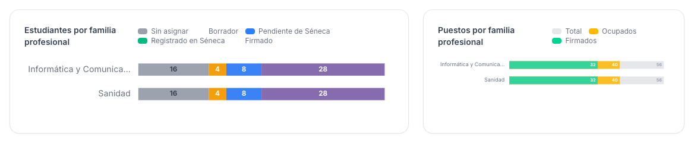
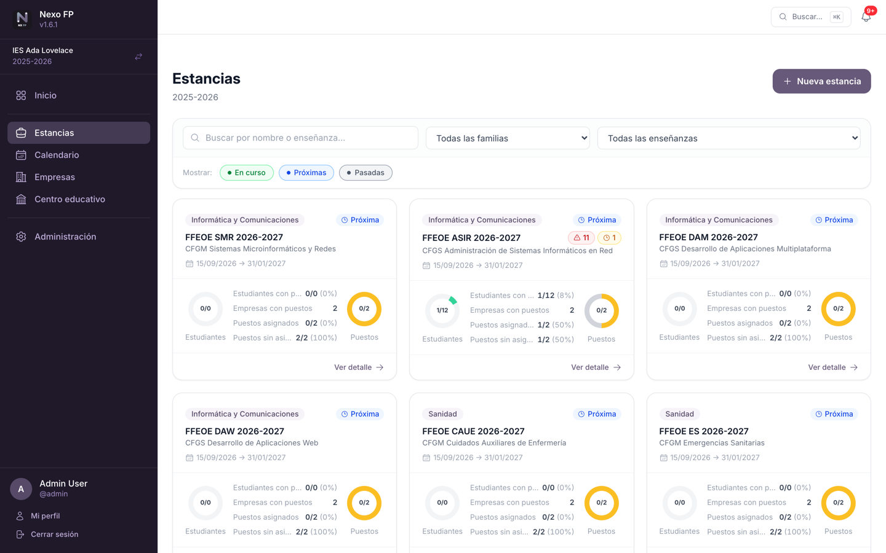
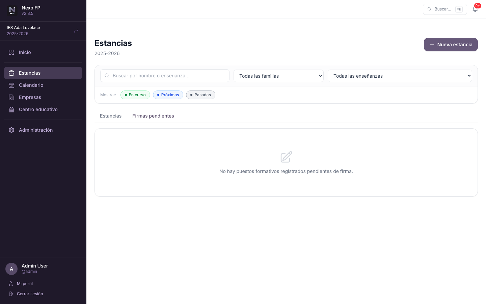
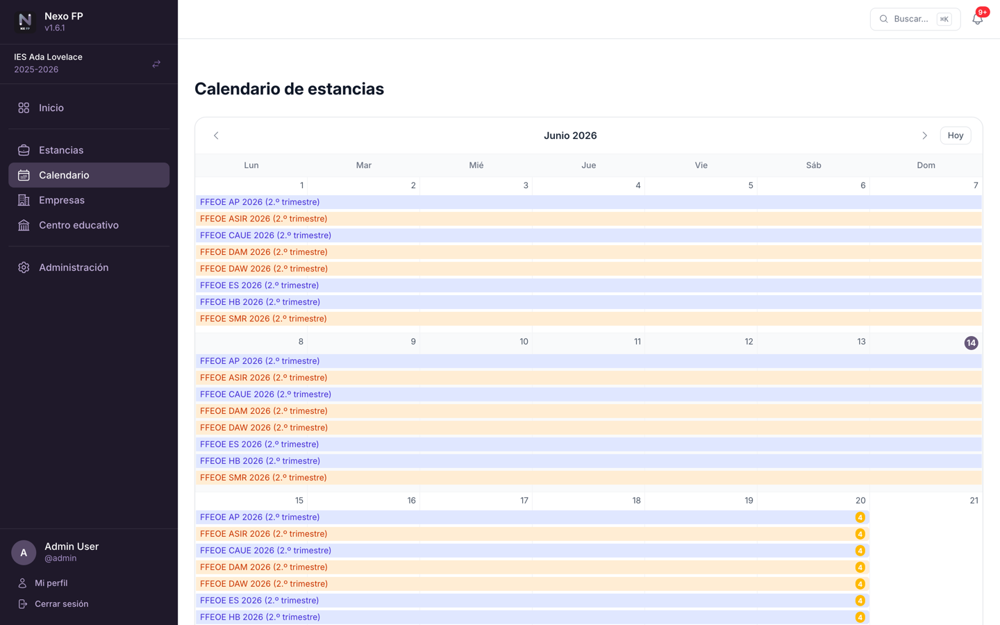
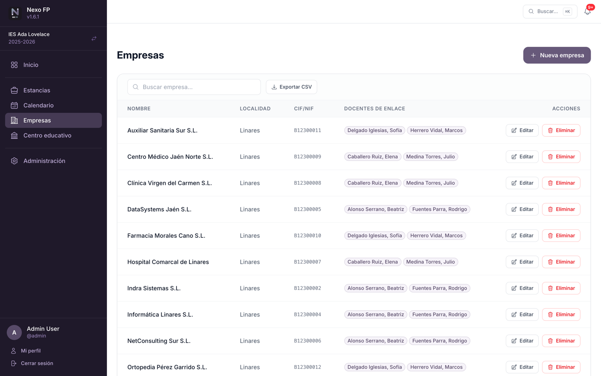
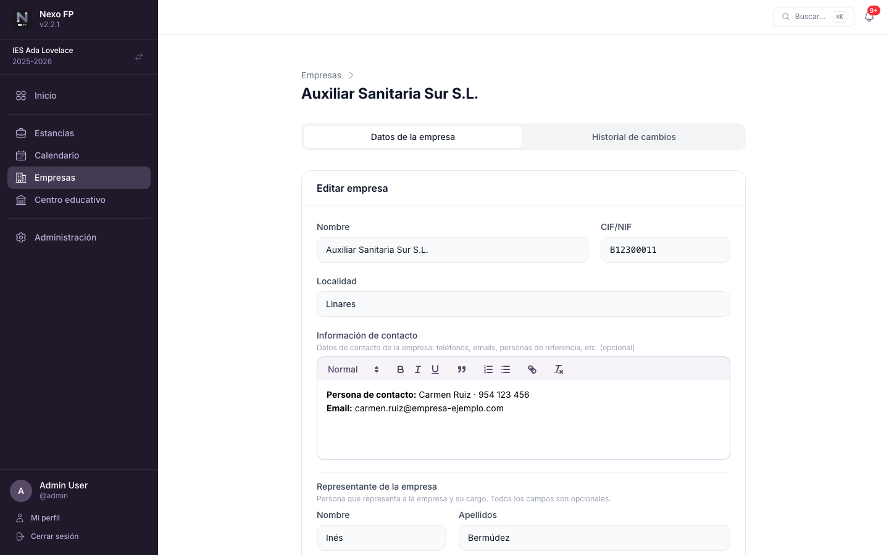
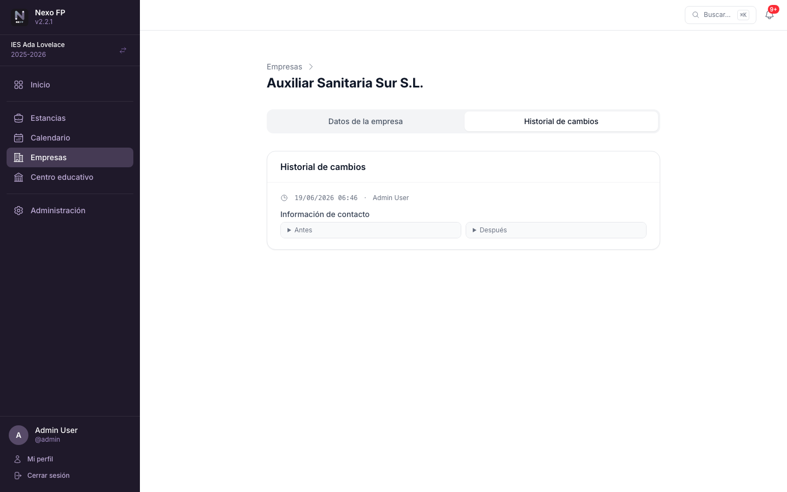
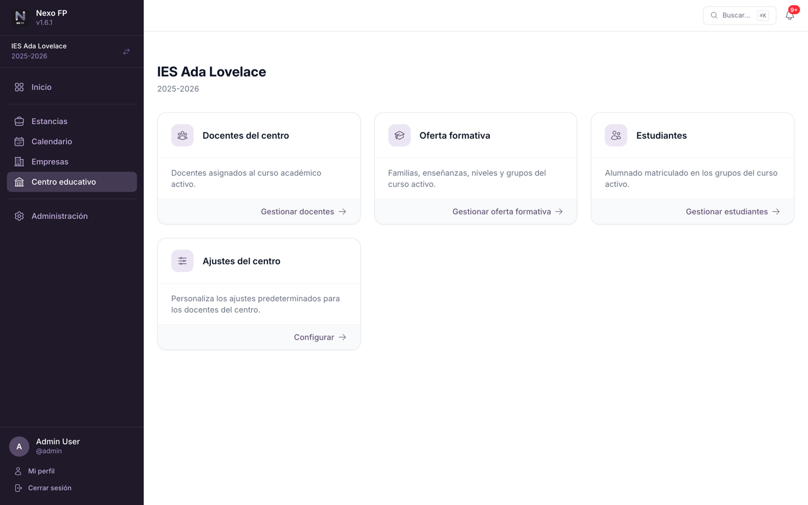
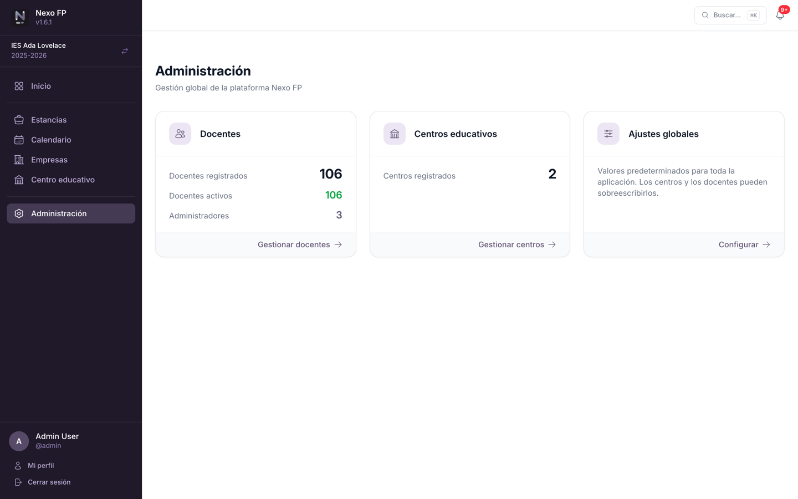

# Secciones de la aplicación

Referencia de cada pantalla de Nexo FP y de lo que permite hacer.

!!! info "Funciones comunes a todos los listados"
    Las tablas de estudiantes, empresas, puestos, centros y docentes comparten varias ayudas: se pueden
    **ordenar** pulsando en las cabeceras de columna (alterna ascendente/descendente), la paginación incluye
    un campo **«Ir a la página»** para saltar directamente, y al pulsar **«Exportar»** aparece un aviso de
    que el archivo se está generando. En móvil y tablet cada fila se muestra como una **tarjeta** apilada (sin
    desplazamiento horizontal). La aplicación cuida la accesibilidad por teclado: el foco es visible al
    navegar, los diálogos de confirmación lo retienen y se cierran con Esc, y al enviar un formulario con
    errores el cursor salta al primer campo incorrecto.

## Inicio

Panel resumen del curso académico activo. Muestra el número de estancias abiertas, puestos formativos
creados, estudiantes inscritos y el estado general de las asignaciones. Cada tarjeta de métricas enlaza
con su sección correspondiente y, según los permisos del docente, se muestran **accesos rápidos** para
crear una estancia, importar estudiantes o registrar una empresa.

La gráfica **Estado de los puestos** desglosa los puestos del curso en cuatro categorías: *Borrador*,
*Pendiente de Séneca*, *Registrado en Séneca* (registrado pero aún sin firmar) y *Firmado* (registrado en
Séneca y con el convenio firmado).

Los **administradores globales y de centro** disponen además de dos gráficas por familia profesional:
**Estudiantes por familia profesional**, que clasifica al alumnado de las estancias según el estado de su
puesto (sin asignar, borrador, pendiente, registrado y firmado), y **Puestos por familia profesional**,
con el total de puestos, los ocupados y los firmados. El resto de docentes no ven estas dos gráficas.

Al final del panel, el bloque **Pendientes** lista las estancias activas que requieren atención:
estudiantes sin puesto asignado, puestos libres, puestos sin tutor/a dual docente o de empresa, y puestos
finalizados sin firmar. Cada estancia enlaza directamente con su página de detalle.

La cabecera incluye una **campana de notificaciones** que muestra en tiempo real las tareas pendientes
del docente: firmas próximas a vencer, puestos sin estudiante, sin tutor académico o sin tutor de
empresa, y estudiantes sin puesto asignado.

La **búsqueda global** (⌘K / Ctrl+K) permite localizar estancias, empresas, estudiantes y docentes desde
cualquier página, aplicando los mismos permisos que la barra lateral. Los resultados aparecen en tiempo
real con navegación por teclado (↑ ↓ Enter) y cierre con Esc.

## Estancias

Una **estancia** agrupa un conjunto de puestos formativos de una misma enseñanza dentro de un periodo
concreto. Desde esta sección se puede:

- Crear y editar estancias con nombre, enseñanza y fechas de inicio y fin.
- Añadir, editar y eliminar **puestos formativos** dentro de cada estancia.
- Inscribir o retirar estudiantes de la estancia.
- Asignar estudiantes y tutores directamente desde el detalle, con un modo de **asignación rápida** que
  muestra los selectores en todas las filas a la vez.
- Descargar un **informe PDF** con el detalle de todos los puestos y sus asignaciones. Para cada empresa
  se incluye el CIF y, si están registrados, el representante (nombre, DNI y cargo); junto al tutor/a dual
  de empresa se muestra su DNI.
- Exportar los puestos de la estancia a **Excel** con estudiante, empresa, centro de trabajo, tutorías y
  estado.
- Los **filtros** (búsqueda, familia profesional, enseñanza y período) se recuerdan por centro en el
  navegador y se restauran automáticamente al volver al listado.

!!! warning "Visibilidad según rol"
    Un docente solo ve en el listado las estancias de las enseñanzas en las que tiene algún rol. Las
    estancias de otras enseñanzas no aparecen ni son accesibles (consulta
    [Roles y permisos](03-roles-y-permisos.md)).

!!! warning "Puestos sin asignar"
    Los tutores/as y docentes de grupo ven el detalle de la estancia y los puestos formativos de sus
    estudiantes, pero **no** el bloque de **puestos sin asignar**. Estos solo son visibles para quienes
    gestionan la estancia (administración, coordinación o jefatura de departamento) y para los docentes de
    enlace de las empresas implicadas. La misma regla se aplica al informe PDF y a la exportación a Excel.

Cada puesto formativo registra:

| Campo | Descripción |
|-------|-------------|
| Centro de trabajo | Sede de la empresa donde se realizará la estancia |
| Estudiante | Alumno/a asignado/a al puesto |
| Tutor/a dual docente | Profesor/a responsable del seguimiento académico |
| Tutor/a dual de empresa | Empleado/a responsable en la empresa |
| Nivel | Curso(s) de la enseñanza al que corresponde el puesto («1.º», «2.º» o «1.º y 2.º») |
| Fechas | Inicio y fin propios del puesto (pueden diferir de la estancia) |
| Estado | `Borrador`, `Pendiente de Séneca` o `Registrado en Séneca` |
| Firmado | Indica si el convenio está firmado |

### Firmas pendientes

La pestaña **Firmas pendientes**, junto a «Estancias», muestra todos los puestos formativos que ya están
registrados en Séneca pero cuyo convenio todavía no se ha firmado. Los mismos filtros de búsqueda,
familia, enseñanza y período que controlan el listado de estancias se aplican también a esta pestaña sin
necesidad de ajustarlos de nuevo. Una insignia numérica sobre la pestaña indica cuántos puestos están
pendientes con los filtros activos.

La búsqueda de texto localiza por nombre de estancia, enseñanza, nombre del estudiante (nombre y
apellidos) y nombre del grupo al que pertenece el puesto.

La lista incluye las columnas **Estudiante**, **Estancia**, **Grupo**, **Empresa**, **Tutor/a docente** y
**Fecha de inicio**, con las tres primeras ordenables haciendo clic en la cabecera. La columna «Fecha de
inicio» se muestra en rojo si quedan 7 días o menos y en ámbar si quedan 30 o menos, para priorizar los
convenios que hay que tener firmados antes de que arranque la estancia (la ordenación por defecto es por
fecha de inicio ascendente). En pantallas pequeñas los resultados se presentan como tarjetas.

!!! info "Visibilidad según rol"
    La pestaña aplica los mismos permisos que el listado de estancias: cada docente solo ve los puestos
    de las enseñanzas en las que tiene algún rol (coordinador/a, jefe/a de familia, tutor/a de grupo,
    docente de grupo o docente de enlace de empresa).

### Trabajo simultáneo y actualización en vivo

Varias personas pueden gestionar los puestos de una misma estancia a la vez (dirección, coordinación,
jefatura de familia y docentes de enlace). El detalle de la estancia se **actualiza en vivo**: cuando
alguien crea o elimina un puesto, asigna un estudiante o un tutor, cambia un estado o firma, las demás
pantallas abiertas de esa estancia se refrescan solas en menos de un segundo, sin recargar. Cada
pantalla muestra siempre lo que su rol permite ver. Las filas que cambian por la acción de otra persona
(o las que aparecen nuevas) se **resaltan brevemente** con una animación para que se vea de un vistazo qué
se ha modificado. Esta función requiere el despliegue con FrankenPHP (Docker o binario nativo); ver
[Sincronización en vivo](09-despliegue.md#sincronizacion-en-vivo-mercure).

Al editar un puesto desde el formulario a página completa, si otra persona lo ha modificado mientras
tanto, la aplicación **avisa del conflicto** y pide revisar los datos actualizados antes de volver a
guardar, en lugar de sobrescribir el cambio de la otra persona.

## Calendario

Vista mensual de todas las estancias visibles para el docente. Muestra cada estancia como una barra de
color (un color por familia profesional) con gestión automática de carriles para estancias solapadas. Un
badge ámbar al final de cada barra indica el número de puestos pendientes de firma.

La navegación mes a mes se realiza sin recarga completa de página. Cada barra enlaza directamente con el
detalle de la estancia.

## Empresas

Directorio de empresas colaboradoras del centro. Permite registrar y gestionar:

- **Datos de la empresa**: nombre, CIF/NIF y localidad.
- **Información de contacto**: campo de texto enriquecido (negrita, cursiva, listas, enlaces…) para
  anotar teléfonos, correos electrónicos, personas de referencia y cualquier otro dato de contacto.
- **Representante** de la empresa (nombre, apellidos, DNI/NIE y cargo); todos los campos son opcionales.
- **Centros de trabajo** (sedes o filiales) donde los estudiantes realizarán su formación.
- **Empleados** de la empresa que pueden actuar como tutores de empresa.
- **Docentes de enlace** asignados a cada empresa.
- **Observaciones**: campo de texto libre para anotaciones internas.

El listado de empresas puede exportarse a **Excel** respetando el filtro de búsqueda activo; la exportación
incluye también el representante (nombre, DNI/NIE y cargo).

### Historial de cambios

Cada ficha incluye la pestaña **Historial de cambios**, que registra automáticamente quién modificó la
empresa y qué campos cambiaron, con fecha y hora exactas. Los campos de texto largo (información de
contacto y observaciones) se muestran como secciones desplegables con el valor anterior y el nuevo.

!!! info "Acceso restringido"
    Esta sección solo es visible para administradores/as de centro, coordinadores/as de FP dual, jefes/as
    de departamento de familia profesional y docentes de enlace.

## Centro Educativo

Gestión interna del centro. Reúne en un único espacio:

- **Docentes del curso:** alta, baja e importación del personal adscrito al curso activo.
- **Estudiantes:** alta, edición, baja e importación masiva desde CSV (formato de exportación de Séneca;
  ver [Primeros pasos](02-primeros-pasos.md#formato-del-csv-de-importacion)).
- **Oferta formativa:** estructura jerárquica completa (familias profesionales → enseñanzas → niveles →
  grupos, con asignación de tutor y docentes a cada grupo). Incluye **exportación e importación en JSON**
  para copiar la estructura entre cursos o centros (ver más abajo).
- **Cursos académicos:** crear y activar cursos del centro.

### Exportar e importar la oferta formativa

Desde la página principal de **Oferta formativa** están disponibles dos acciones:

- **Exportar JSON** — descarga un fichero `.json` con toda la estructura del curso activo: familias
  profesionales, enseñanzas, niveles, grupos y los nombres de usuario de los docentes asignados
  (responsable de familia, coordinadores de enseñanza, docentes y tutores de cada grupo).
- **Importar JSON** — carga un fichero exportado previamente y crea o actualiza la estructura en el
  curso activo del centro. Si una familia, enseñanza, nivel o grupo con el mismo nombre ya existe, se
  actualiza (no se duplica). Los docentes se buscan por nombre de usuario; si alguno no existe en el
  servidor de destino, su asignación se omite y el mensaje de resultado indica qué usuarios no se
  han encontrado.

El caso de uso habitual es **copiar la oferta de un curso al siguiente**: exporta el curso actual,
activa el nuevo curso académico e importa el fichero.

## Administración

Sección exclusiva para administradores globales. Permite:

- Gestionar todos los **docentes** del sistema (alta, baja, activación, asignación de rol de
  administrador, tipo de autenticación).
- Gestionar **centros educativos**: crearlos, asignarles el equipo directivo y gestionar sus cursos
  académicos.
