<!-- _class: lead -->

# Nexo FP

## Gestión de la Fase de Formación en Empresa u Organismo Equiparado (FFEOE)

Una aplicación web para planificar y asignar las estancias del alumnado en empresas.

*Presentación para profesorado de FP · versión 2.0.0*

---

## El problema que resuelve

Hoy, la gestión de la FFEOE suele estar **repartida** en hojas de cálculo, correos y documentos sueltos:

- ¿Qué estudiante va a qué empresa? ¿Con qué tutor docente y qué tutor de empresa?
- ¿En qué estado está cada acuerdo? ¿Está firmado? ¿Tramitado en Séneca?
- ¿Qué falta por firmar antes de que termine el trimestre?

**Nexo FP centraliza todo ese flujo** en un único lugar, multicentro y por curso académico:
estudiantes, empresas, tutores, estados y firmas — con avisos automáticos y exportaciones.

---

## ¿Qué es Nexo FP?

<!-- _class: tight -->

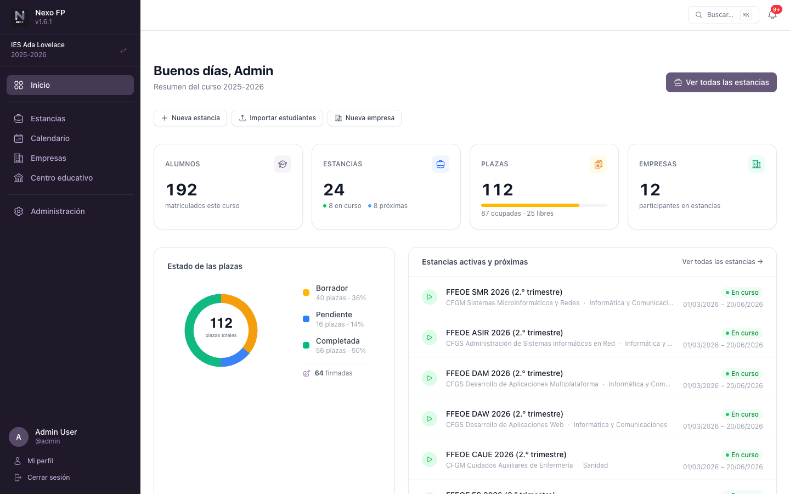

Una herramienta de **gestión integral de estancias**. En tres ideas:

1. **Planificar** — define el curso, las enseñanzas, los grupos y las empresas.
2. **Asignar** — crea estancias y reparte estudiantes, tutores docentes y mentores.
3. **Firmar** — sigue el estado de cada puesto hasta su firma y su tramitación.

El panel de inicio resume el curso de un vistazo: alumnado, estancias, plazas y empresas.

---

## El modelo de datos, de un vistazo

<div style="font-size:22px">

**Estructura académica**
`Curso académico` → `Familia profesional` → `Enseñanza` → `Nivel` → `Grupo` → `Estudiantes`

**Tejido empresarial**
`Empresa` → `Centro de trabajo` → `Trabajadores` (mentores)

**El nexo entre ambos**
`Estancia` (período + enseñanza) → `Puestos formativos`
  cada puesto = **un estudiante + un tutor docente + un tutor de empresa + un estado**

</div>

> Todo cuelga del **curso académico activo** de cada centro: al cambiar de curso, cambia el contexto.

---

## Siete perfiles, un mismo flujo

<!-- _class: tight -->

| Perfil | Quién es | Qué puede hacer |
|---|---|---|
| **Admin global** | TIC / soporte | Todo, en todos los centros; alta de centros y docentes |
| **Admin de centro** | Equipo directivo | Gestiona su centro: curso, oferta, estudiantes, ajustes |
| **Jefe/a de familia** | Jefatura de departamento | Gestiona las enseñanzas de su familia profesional |
| **Coordinador/a dual** | Coordinación de la FFEOE | Gestiona estancias y puestos de sus enseñanzas |
| **Docente de enlace** | Profesorado en empresa | Edita los puestos **sin estudiante** asignado de su empresa |
| **Tutor/a de grupo** | Tutoría docente | Consulta sus estancias y firma los puestos a su cargo |
| **Docente** | Profesorado | Acceso de consulta según sus asignaciones |

Los permisos se derivan de los **datos** (equipo directivo, jefatura, coordinación, enlace…), no de roles sueltos.

---

## Multicentro: un acceso, varios centros

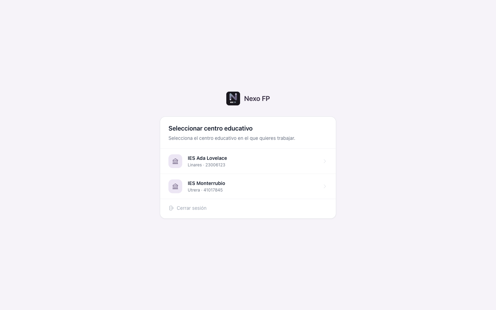

- Un mismo docente puede pertenecer a **varios centros**.
- Al entrar, **elige el centro** en el que va a trabajar.
- Los datos quedan **aislados por centro**: nunca se mezcla el alumnado o las empresas de un IES con los de otro.
- El centro activo se ve siempre arriba a la izquierda y se cambia con un clic.

---

<!-- _class: sep -->

# El curso, paso a paso

## Quién hace qué, en orden

---

## 1 · Preparar el curso — Admin de centro

<!-- _class: tight -->

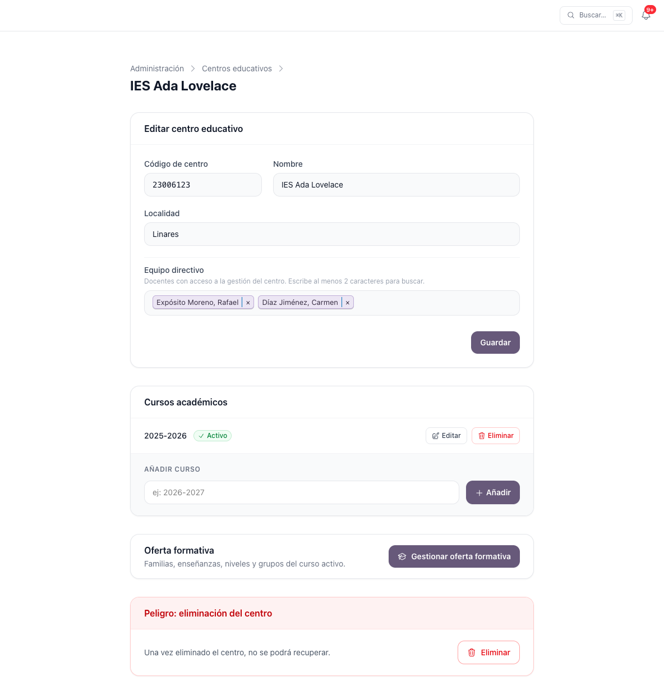

Desde **Administración › Centros educativos**:

- **Equipo directivo**: docentes con acceso a la gestión del centro.
- **Cursos académicos**: crear el curso y marcarlo como **Activo**.
- **Oferta formativa**: puerta de entrada a familias, enseñanzas, niveles y grupos.

> Es el primer paso de cada curso: sin curso activo, no hay contexto de trabajo.

---

## 2 · Oferta formativa — familias y enseñanzas

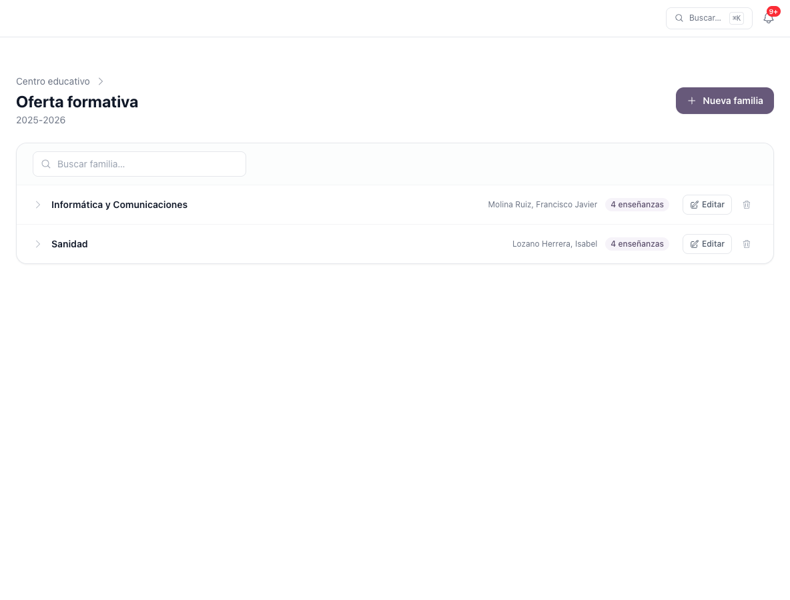

En **Centro educativo › Oferta formativa**:

- Cada **familia profesional** tiene un jefe/a de departamento.
- Dentro, sus **enseñanzas** (ciclos): CFGM, CFGS…
- La búsqueda y el plegado facilitan navegar ofertas grandes.

---

## 2 · Estructura docente de la enseñanza

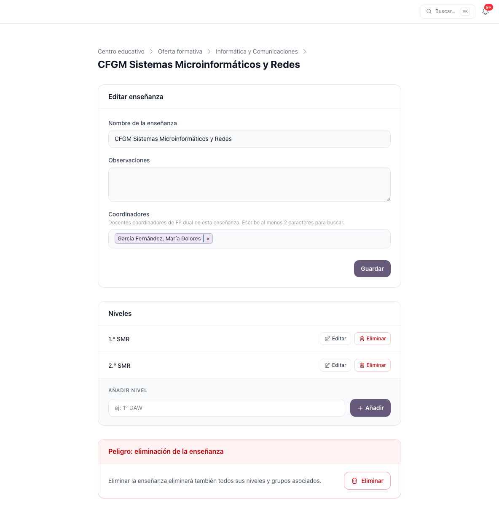

Al editar una **enseñanza**:

- **Coordinadores duales** (gestionan sus estancias).
- **Niveles** del ciclo (1.º, 2.º…), y dentro de cada nivel, los **grupos**.
- En los grupos se asignan **tutores** y **docentes**.

> Coordinación, jefatura y tutoría son **personas concretas**: de ahí salen los permisos.

---

## 3 · Estudiantes

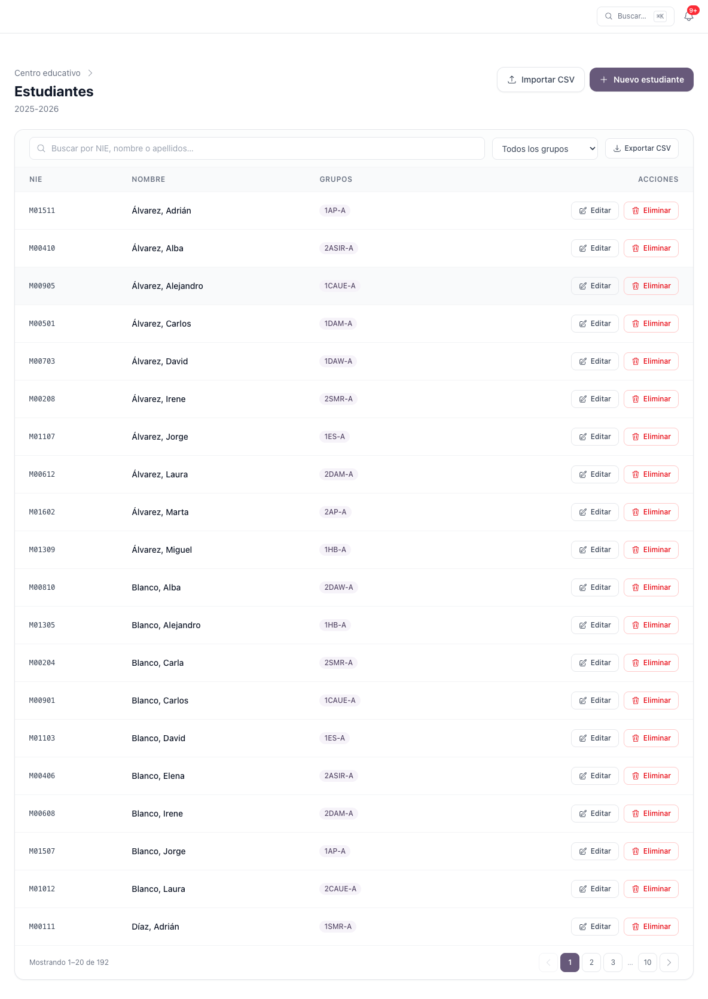

En **Centro educativo › Estudiantes**:

- Alta manual o **importación por CSV**.
- Cada estudiante pertenece a un **grupo**.
- Búsqueda por NIE/nombre, filtro por grupo y **exportación CSV**.

---

## 4 · Empresas, centros de trabajo y mentores

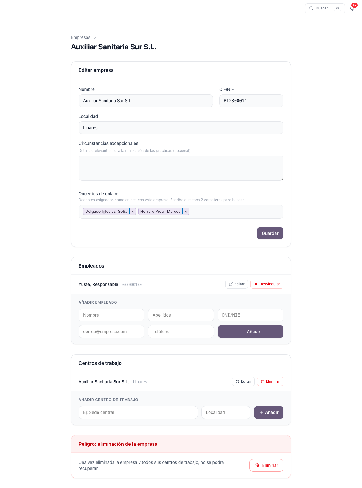

En **Empresas**:

- Alta con **CIF/NIF** y localidad; listado con **exportación CSV**.
- Cada empresa tiene sus **centros de trabajo**.
- Y sus **empleados**: los **mentores** (tutores de empresa).
- Se asignan **docentes de enlace** que la gestionan.

---

## 5 · Crear una estancia

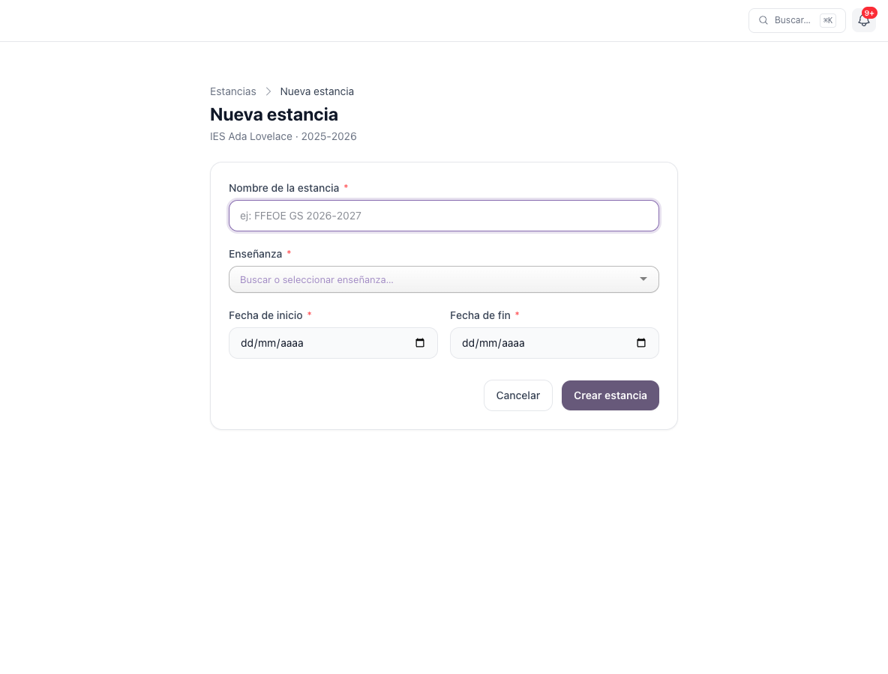

Una **estancia** agrupa los puestos de una enseñanza en un período:

- Se elige la **enseñanza** y las **fechas** (inicio y fin).
- Una misma enseñanza puede tener **varias estancias** que se solapen
  (no todos los grupos hacen la FFEOE a la vez).

> El formulario evita envíos duplicados al pulsar dos veces.

---

## 5 · El listado de estancias

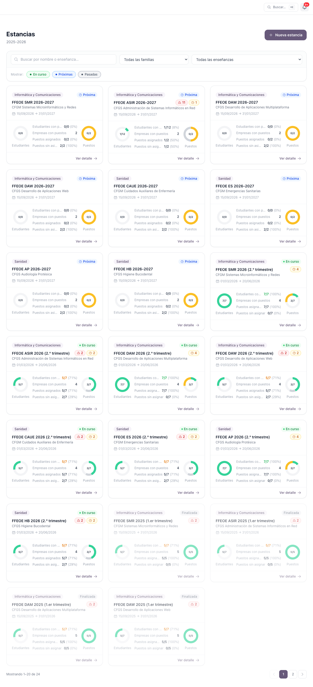

- Tarjetas con **estado de ocupación** (plazas, firmadas) y período.
- Filtros por **familia**, **enseñanza** y búsqueda, **recordados por centro**.
- Indicadores visuales del progreso de cada estancia.

---

## 6 · Detalle de la estancia: los puestos

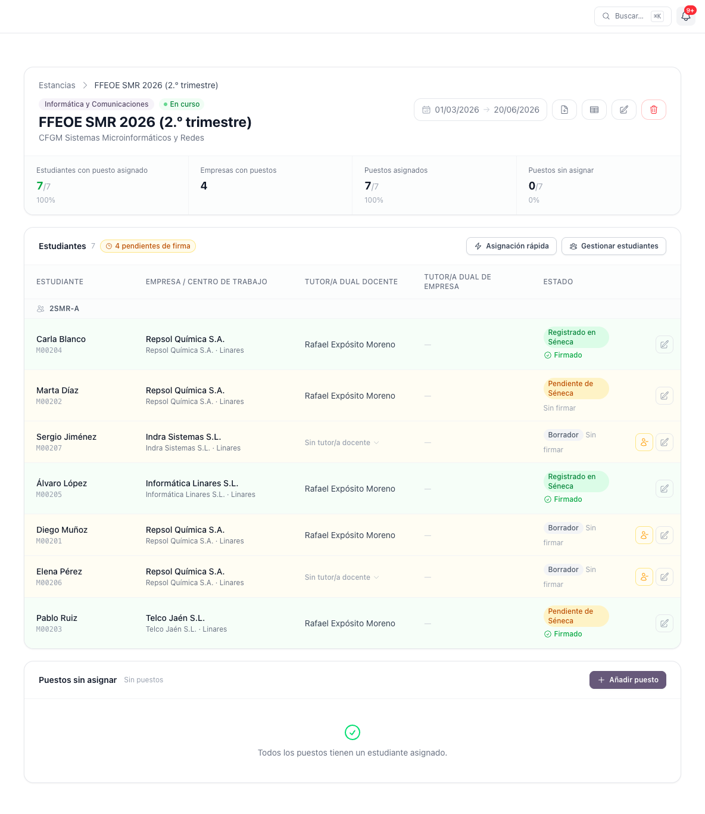

Cada fila es un **puesto formativo**:

- **Estudiante** · **Empresa / centro de trabajo**
- **Tutor dual docente** · **Tutor dual de empresa**
- **Estado** (Borrador, Pendiente, Registrado en Séneca)

Se asignan estudiantes y tutores con un modo de **asignación rápida** (selectores en
todas las filas) y se exporta el **informe PDF** y los puestos a **CSV**.

---

## 7 · Asignar un puesto

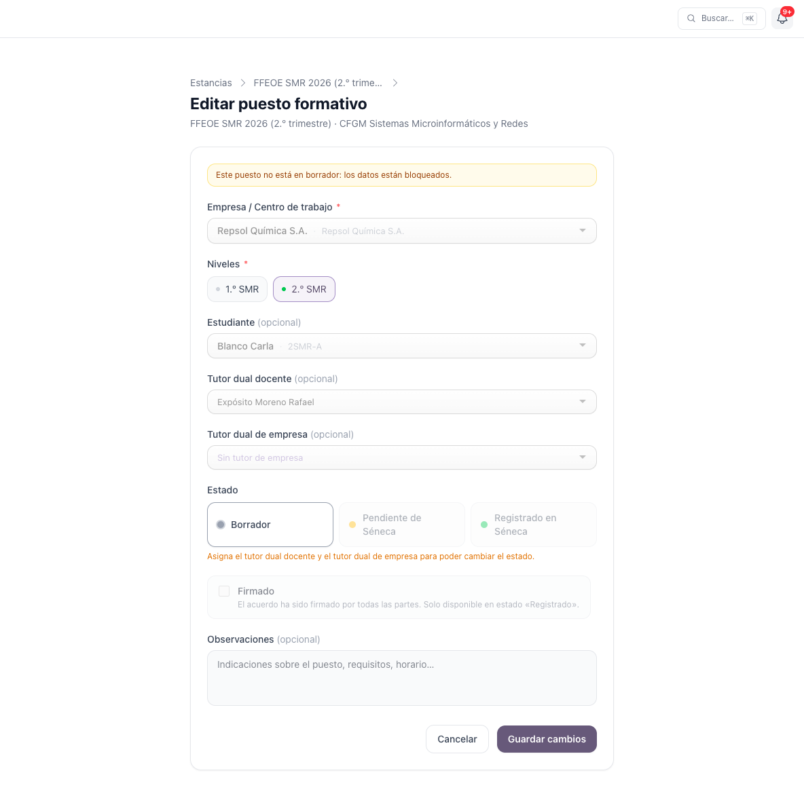

Al **editar un puesto** se define:

- **Empresa / centro de trabajo** y **nivel**
- **Estudiante** (opcional al crearlo)
- **Tutor dual docente** y **tutor dual de empresa**

> El **docente de enlace** de la empresa puede preparar los puestos **antes** de que se asigne estudiante.

---

## 8 · Estados del puesto y firma

<!-- _class: tight -->


Ciclo de vida de cada puesto:

**Borrador** → **Pendiente de Séneca** → **Registrado en Séneca**

- Para salir de *Borrador* hay que asignar **ambos tutores** (docente y de empresa).
- La casilla **Firmado** solo se habilita en *Registrado en Séneca*.
- Se puede volver a *Borrador* para corregir datos.

> La aplicación **bloquea** transiciones inválidas y avisa de lo que falta.

---

## El calendario de estancias

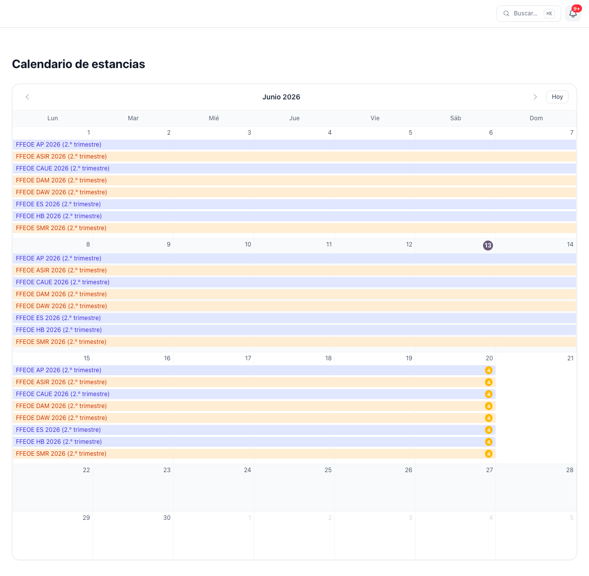

- Vista mensual con cada estancia en su **carril**, un color por **familia profesional**.
- Navegación entre meses sin recargar la página y botón **Hoy**.
- Un **badge ámbar** en cada barra indica los **puestos pendientes de firma**.

---

## Seguimiento: notificaciones y tareas

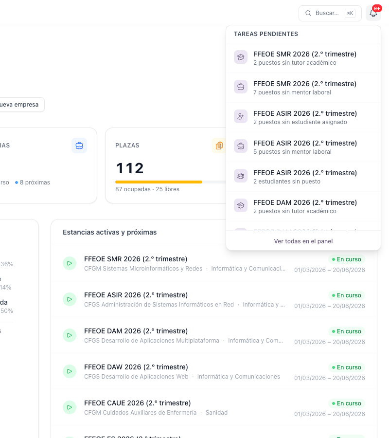

- La **campana** reúne las tareas pendientes del docente: firmas próximas, asignaciones…
- Resalta las firmas dentro de la **ventana de cierre** (próximos días).
- Cada docente solo ve **lo suyo**, en su centro activo.

---

## Búsqueda global ⌘K

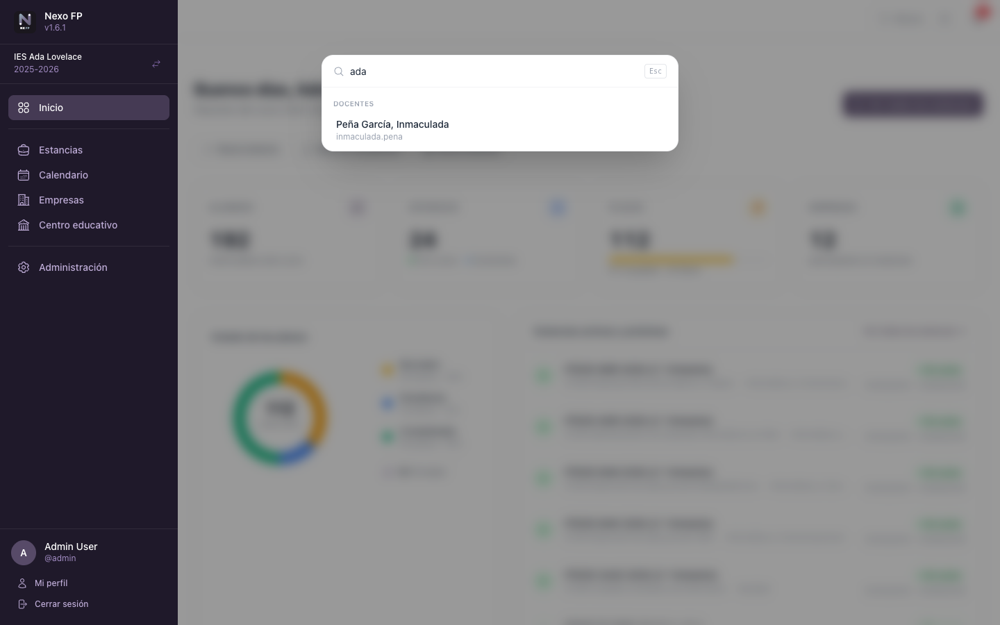

- Atajo **⌘K / Ctrl-K** desde cualquier pantalla.
- Encuentra estancias, empresas, estudiantes y secciones al instante.
- Navegación rápida sin pasar por los menús.

---

## Informes y exportaciones

<!-- _class: tight -->

Nexo FP genera la documentación que se necesita fuera de la aplicación:

- **Informe de estancia** en **PDF**, listo para imprimir o tramitar.
- **Exportación CSV** de estudiantes, empresas y puestos.
- **Avisos por email** automáticos:
  - al **crear puestos** (a los docentes de enlace de la empresa),
  - al **asignar tutoría docente**,
  - **recordatorio de firma** cuando la estancia está próxima a finalizar.

> Cada centro y cada docente puede **activar o desactivar** estos avisos en sus ajustes.

---

## Perfil de usuario

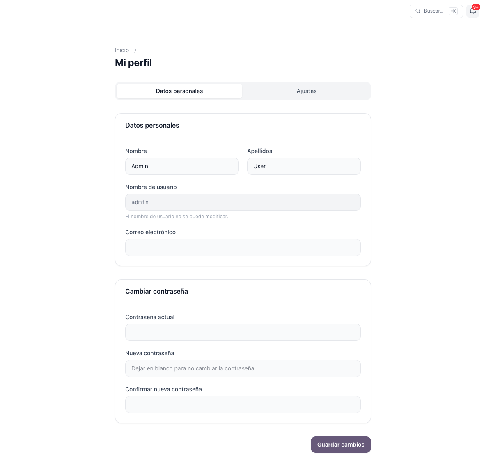

Cada persona gestiona su cuenta en **Mi perfil**:

- Datos personales y **correo electrónico** (con verificación).
- **Cambio de contraseña**; y restablecimiento por email si se olvida.
- Ajustes personales que **sobrescriben** los del centro.

---

<!-- _class: sep -->

# Instalación de la aplicación

## Configuración y despliegue

---

## Tres formas de desplegar

<!-- _class: tight -->

| Modo | Base de datos | Para quién | Esfuerzo |
|---|---|---|---|
| **Binario** (FrankenPHP) | SQLite | Un centro, "doble clic" | Mínimo |
| **Docker Compose** | PostgreSQL | Servidor / producción | Medio |
| **Desarrollo local** | PostgreSQL | Contribuir al proyecto | Para técnicos |

- El **binario** es un único ejecutable: ideal para un IES sin infraestructura.
- **Docker** añade HTTPS automático y base de datos robusta para varios centros.
- En los tres casos, las **migraciones de base de datos se aplican solas** al arrancar.

---

## Despliegue binario (lo más sencillo)

<!-- _class: tight -->

En `dist/` hay un lanzador por sistema operativo:

- `start.sh` (Linux/macOS) · `start.ps1` (PowerShell) · `start.bat` (Windows)

Al ejecutarlo:

1. Arranca **FrankenPHP** (servidor de aplicaciones autocontenido).
2. Usa **SQLite** como base de datos (un solo fichero, fácil de copiar).
3. Aplica migraciones y deja la aplicación lista en el navegador.
4. Lanza en segundo plano el **worker de correos** (envío asíncrono).

> Copiar el fichero de base de datos = copia de seguridad completa.

---

## Despliegue con Docker Compose

<!-- _class: tight -->

```bash
cp .env.example .env      # define APP_SECRET y DB_PASSWORD
docker compose up -d
```

La primera vez, el contenedor automáticamente:

1. Aplica las **migraciones**.
2. Crea el admin inicial (`admin` / `admin`) y el centro `IES Test`.
3. Precalienta la caché.

- Base de datos **PostgreSQL 16**.
- **Caddy + Let's Encrypt**: HTTPS automático con tu dominio.
- Disponible en `http://localhost` (o tu dominio en producción).

---

## Configuración por variables de entorno

<!-- _class: tight -->

| Variable | Para qué |
|---|---|
| `APP_SECRET` | Clave de seguridad (64 hex aleatorios) |
| `DATABASE_URL` | Conexión a la base de datos |
| `MAILER_DSN` | Servidor SMTP para los emails |
| `MAILER_FROM` | Remitente de los correos automáticos |
| `DEFAULT_URI` | URL pública (enlaces de los emails) |
| `MESSENGER_TRANSPORT_DSN` | Cola de envío asíncrono de correos |
| `APP_EXTERNAL_*` | Integración con **Séneca** (Junta de Andalucía) |

> Con `APP_EXTERNAL_ENABLED` el profesorado puede autenticarse con sus credenciales de Séneca.

---

<!-- _class: tight -->

## Puesta en marcha y ajustes

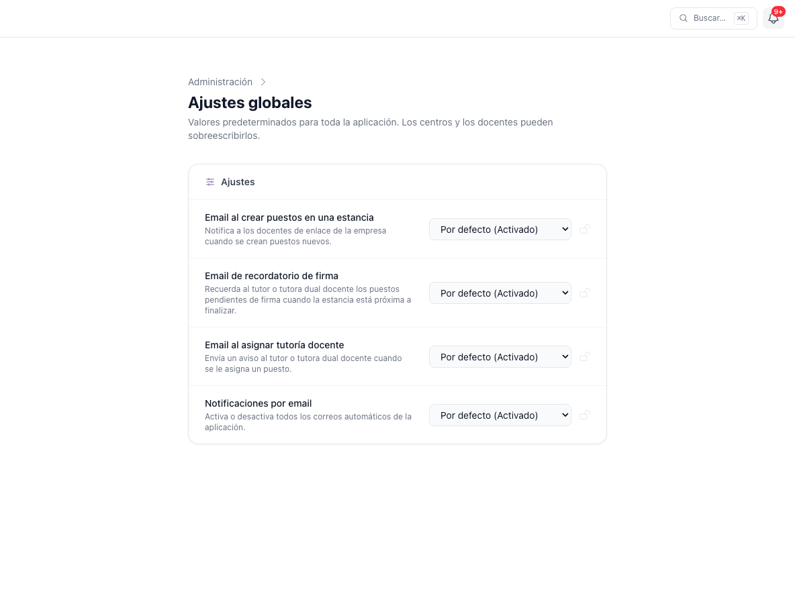

Comandos de consola:

- `app:setup` — admin inicial + centro de prueba (primer arranque).
- `app:create-admin` — crear administradores.
- `app:create-educational-centre` — alta de centros.
- `app:send-reminders` — recordatorios de firma (programable por cron).

**Ajustes jerárquicos**: Global → Centro → Docente. Cada nivel puede
**bloquear** un valor o dejar que el inferior lo cambie.

---

## Operación del día a día

<!-- _class: tight -->

- **Copias de seguridad**: SQLite = un fichero; PostgreSQL = `pg_dump`.
- **Correos en cola** (Messenger): si un envío falla, se reintenta y, si no,
  queda registrado para revisarlo:
  ```bash
  php bin/console messenger:failed:show
  php bin/console messenger:failed:retry
  php bin/console messenger:failed:remove <id>
  ```
- **Recordatorios** automáticos vía `app:send-reminders` (por ejemplo, a diario a las 8:00).

> El envío asíncrono mantiene la aplicación **rápida**: el usuario no espera al correo.

---

## En resumen

<!-- _class: tight -->

**Nexo FP** convierte la gestión de la FFEOE en un flujo claro y compartido:

1. **Un único sitio** para estudiantes, empresas, tutores, estados y firmas.
2. **Cada rol ve y hace lo justo**, con permisos derivados de los datos reales del centro.
3. **Se despliega como quieras**: desde un doble clic hasta un servidor con HTTPS.

> Menos hojas de cálculo, menos correos sueltos. Más control y trazabilidad.

---

## Un proyecto REASOL

<!-- _class: tight -->

Nexo FP forma parte del **proyecto de innovación educativa REASOL**
(**PIN-219/23** y **PIN-354/24**), financiado por la **Consejería de Desarrollo
Educativo y Formación Profesional** de la **Junta de Andalucía**.

- REASOL impulsa soluciones abiertas para la gestión de la Formación Profesional.
- Nexo FP se publica como **software libre** bajo licencia **AGPL-3.0**.
- El código y la documentación están disponibles para cualquier centro que quiera
  adoptarlo o adaptarlo.

> Una herramienta hecha por y para el profesorado de FP, con financiación pública
> y resultados abiertos.

---

<!-- _class: lead -->

# Gracias

**Recursos**

Repositorio y documentación: `README.md` del proyecto
Datos de demostración y escenarios: `DEMO.md`

*¿Preguntas?*
