<!-- _class: lead -->

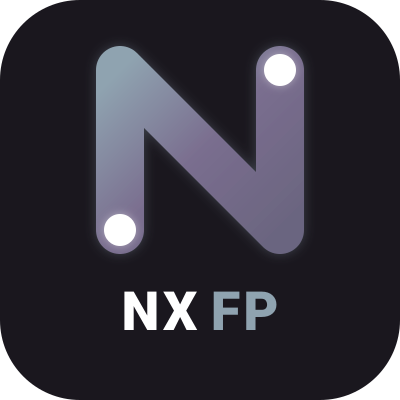

# Nexo FP

## Preparación de la Fase de Formación en Empresa u Organismo Equiparado (FFEOE)

Una aplicación web para planificar y asignar las estancias del alumnado en empresas.

*Presentación para profesorado de FP · versión {{VERSION}} · {{PUB_DATE}}*

---

## El problema

Hoy, la gestión de la FFEOE suele estar **repartida** en hojas de cálculo, correos y documentos sueltos:

- ¿Qué estudiante va a qué empresa? ¿Con qué tutor docente y qué tutor de empresa?
- ¿En qué estado está cada acuerdo? ¿Está firmado? ¿Tramitado en Séneca?
- ¿Qué falta por firmar antes de que termine el trimestre?

**Nexo FP centraliza todo ese flujo** en un único lugar, multicentro y por curso académico:
estudiantes, empresas, tutores, estados y firmas — con avisos automáticos y exportaciones.

---

## ¿Qué es Nexo FP?

<!-- _class: tight -->

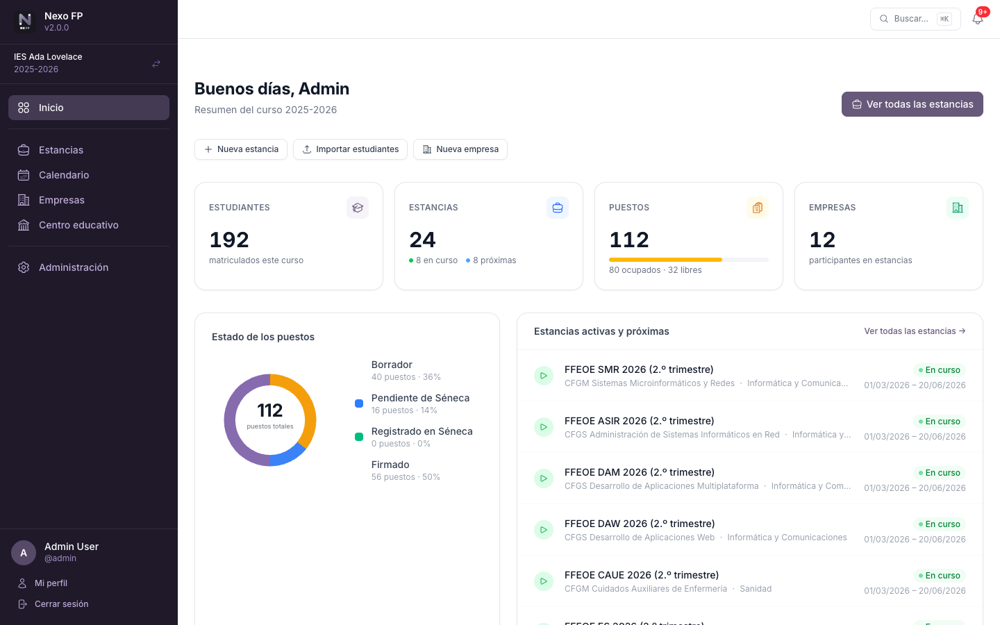

Una herramienta de **gestión integral de estancias**. En tres ideas:

1. **Planificar** — define el curso, las enseñanzas, los grupos y las empresas.
2. **Asignar** — crea estancias y reparte estudiantes, tutores docentes y tutores de empresa.
3. **Firmar** — sigue el estado de cada puesto hasta su firma y su tramitación.

El panel de inicio resume el curso de un vistazo: alumnado, estancias, plazas y empresas.

---

## El modelo de datos, de un vistazo

<div style="font-size:22px">

**Estructura académica**
`Curso académico` → `Familia profesional` → `Enseñanza` → `Nivel` → `Grupo` → `Estudiantes`

**Tejido empresarial**
`Empresa` → `Centro de trabajo` → `Trabajadores` (tutores duales de empresa)

**El nexo entre ambos**
`Estancia` (período + enseñanza) → `Puestos formativos`
  cada puesto = **un estudiante + un tutor docente + un tutor de empresa + un estado**

</div>

> Todo cuelga del **curso académico activo** de cada centro: al cambiar de curso, cambia el contexto.

---

## Siete perfiles, un mismo flujo

<!-- _class: tight -->

| Perfil | Quién es | Qué puede hacer |
|---|---|---|
| **Admin global** | TIC / soporte | Todo, en todos los centros; alta de centros y docentes |
| **Admin de centro** | Equipo directivo | Gestiona su centro: curso, oferta, estudiantes, ajustes |
| **Jefe/a de familia** | Jefatura de departamento | Gestiona las enseñanzas de su familia profesional |
| **Coordinador/a dual** | Coordinación de la FFEOE | Gestiona estancias y puestos de sus enseñanzas |
| **Docente de enlace** | Profesorado en empresa | Edita los puestos **sin estudiante** asignado de su empresa |
| **Tutor/a de grupo** | Tutoría docente | Consulta sus estancias y firma los puestos a su cargo |
| **Docente** | Profesorado | Acceso de consulta según sus asignaciones |

Los permisos se derivan de los **datos** (equipo directivo, jefatura, coordinación, enlace…), no de roles sueltos.

---

## Multicentro: un acceso, varios centros

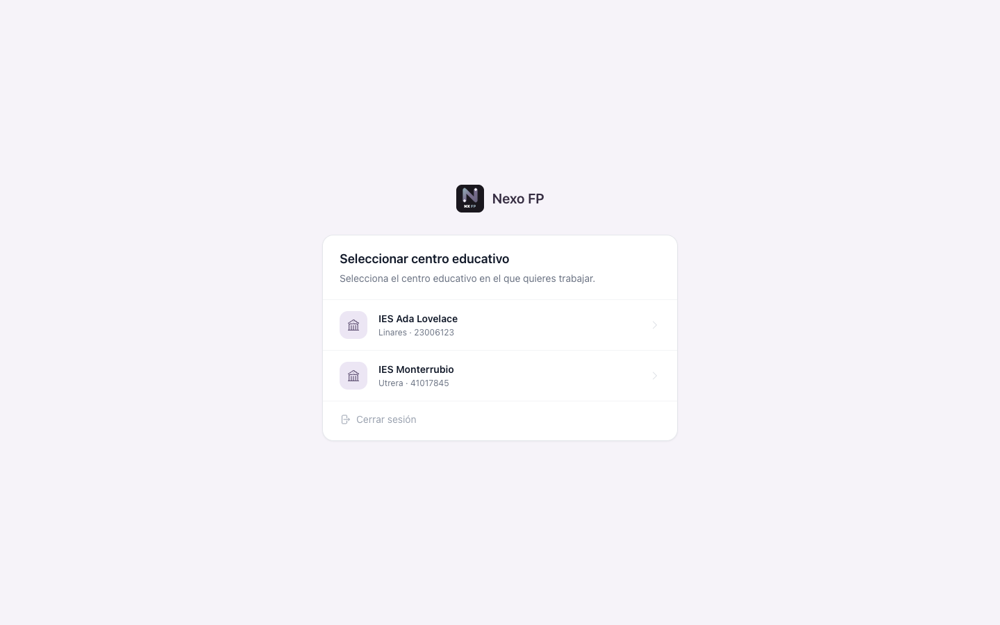

- Un mismo docente puede pertenecer a **varios centros**.
- Al entrar, **elige el centro** en el que va a trabajar.
- Los datos quedan **aislados por centro**: nunca se mezcla el alumnado o las empresas de un IES con los de otro.
- El centro activo se ve siempre arriba a la izquierda y se cambia con un clic.

---

<!-- _class: sep -->

# El curso, paso a paso

## Quién hace qué, en orden

---

## 1 · Preparar el curso — Admin de centro

<!-- _class: tight -->

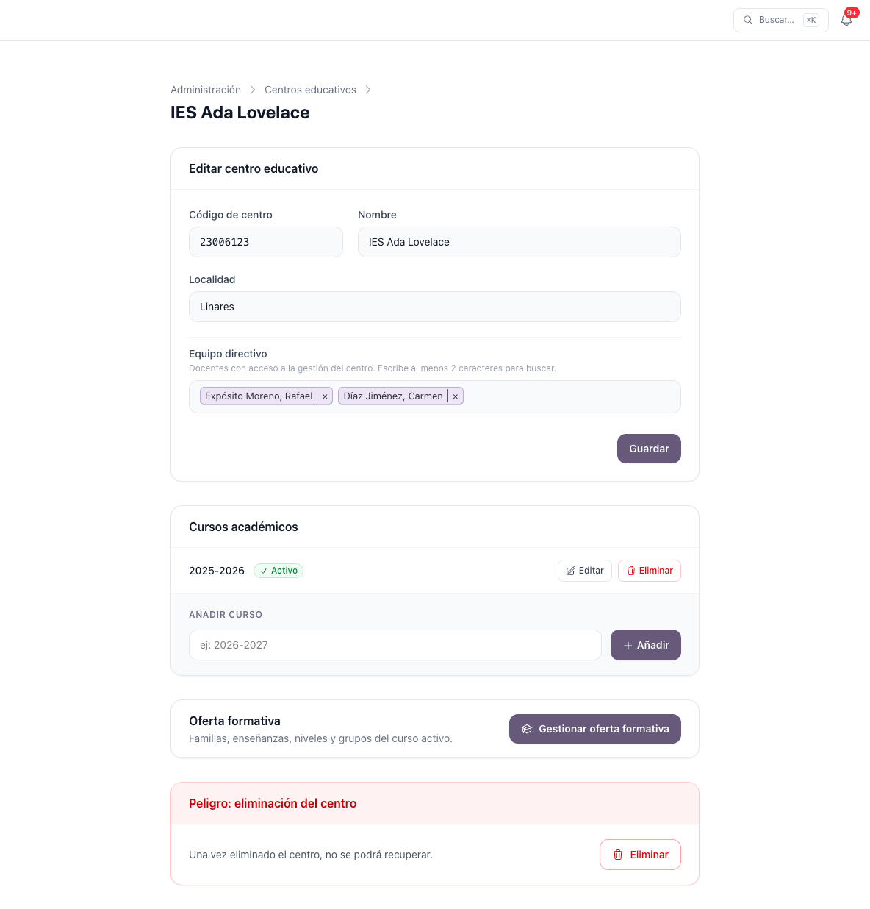

Desde **Administración › Centros educativos**:

- **Equipo directivo**: docentes con acceso a la gestión del centro.
- **Cursos académicos**: crear el curso y marcarlo como **Activo**.
- **Oferta formativa**: puerta de entrada a familias, enseñanzas, niveles y grupos.

> Es el primer paso de cada curso: sin curso activo, no hay contexto de trabajo.

---

## 2 · Docentes del curso

<!-- _class: tight -->

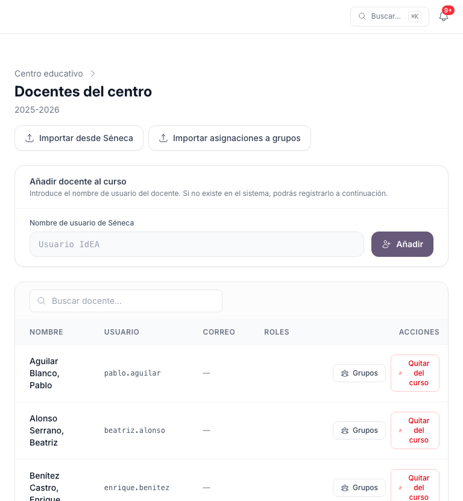

En **Centro educativo › Docentes del curso**:

- Añade el personal adscrito al curso activo — **antes de estructurar la oferta**.
- Sin docentes en el curso no se pueden asignar tutores ni jefaturas.
- Importación masiva desde Séneca (perfil Dirección):
  **Personal › Personal del centro › Exportar datos** (formato CSV)
- Los docentes nuevos se crean con autenticación **IdEA**; los existentes se añaden al curso.

---

## 3 · Oferta formativa — familias y enseñanzas

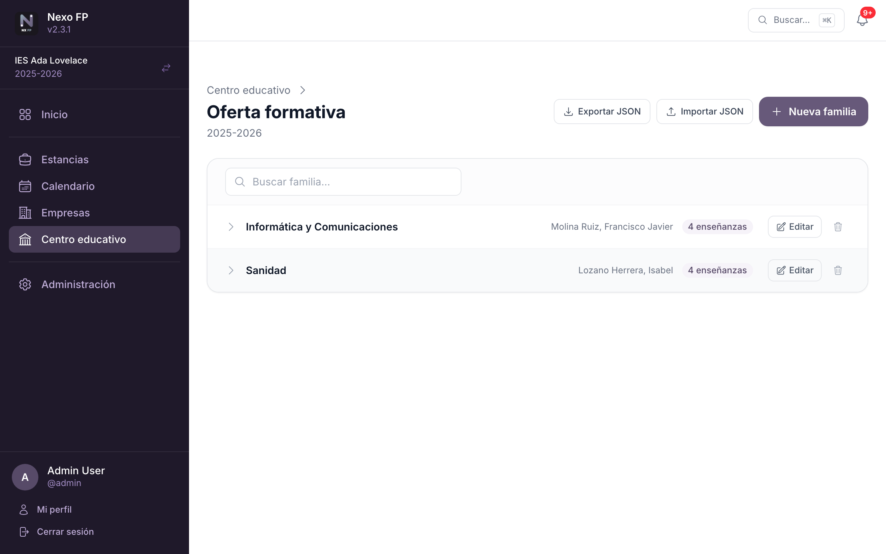

En **Centro educativo › Oferta formativa**:

- Navegación en **columnas**: familias → enseñanzas → niveles → grupos.
- Cada **familia profesional** tiene un jefe/a de departamento.
- Dentro, sus **enseñanzas** (ciclos): CFGM, CFGS…
- Todo se **edita en el mismo panel**, sin cambiar de pantalla; la búsqueda facilita ofertas grandes.
- **Exportar / importar en JSON** para copiar la oferta entre cursos.

---

## 4 · Estructura docente y grupos

<!-- _class: tight -->

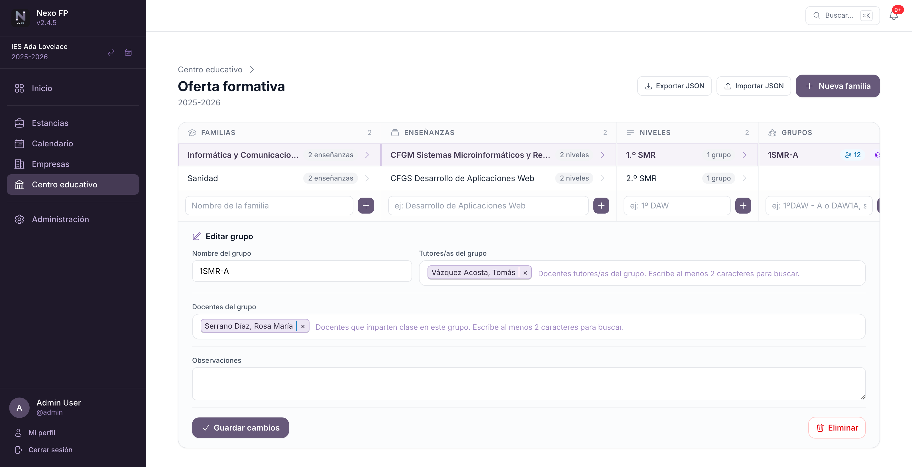

Al seleccionar un elemento, su detalle se edita **en el mismo panel**:

- **Coordinadores duales** de cada enseñanza (gestionan sus estancias).
- **Niveles** del ciclo (1.º, 2.º…), y dentro de cada nivel, los **grupos**.
- En cada grupo se asignan **tutores/as** y **docentes**, sin salir de la pantalla.
- También por CSV de Séneca: **Personal › Personal del centro › Materia y grupos › Exportar datos** (formato CSV)

> Coordinación, jefatura y tutoría son **personas concretas**: de ahí salen los permisos.

---

## 5 · Estudiantes

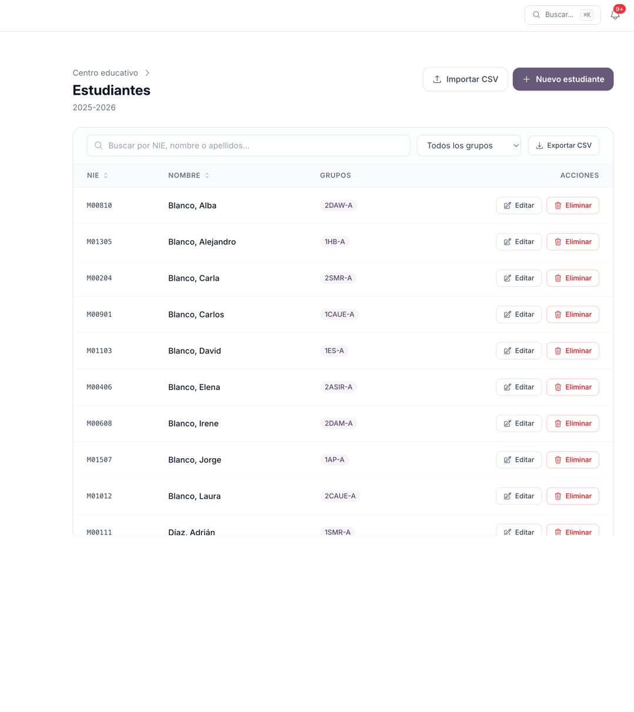

En **Centro educativo › Estudiantes**:

- Alta manual o **importación por CSV**.
- Séneca (perfil Dirección): **Alumnado › Alumnado del centro › Exportar datos** (formato CSV)
- Cada estudiante pertenece a un **grupo**.
- Búsqueda por NIE/nombre y filtro por grupo.

---

## 6 · Empresas, centros de trabajo y tutores duales de empresa

<!-- _class: tight -->

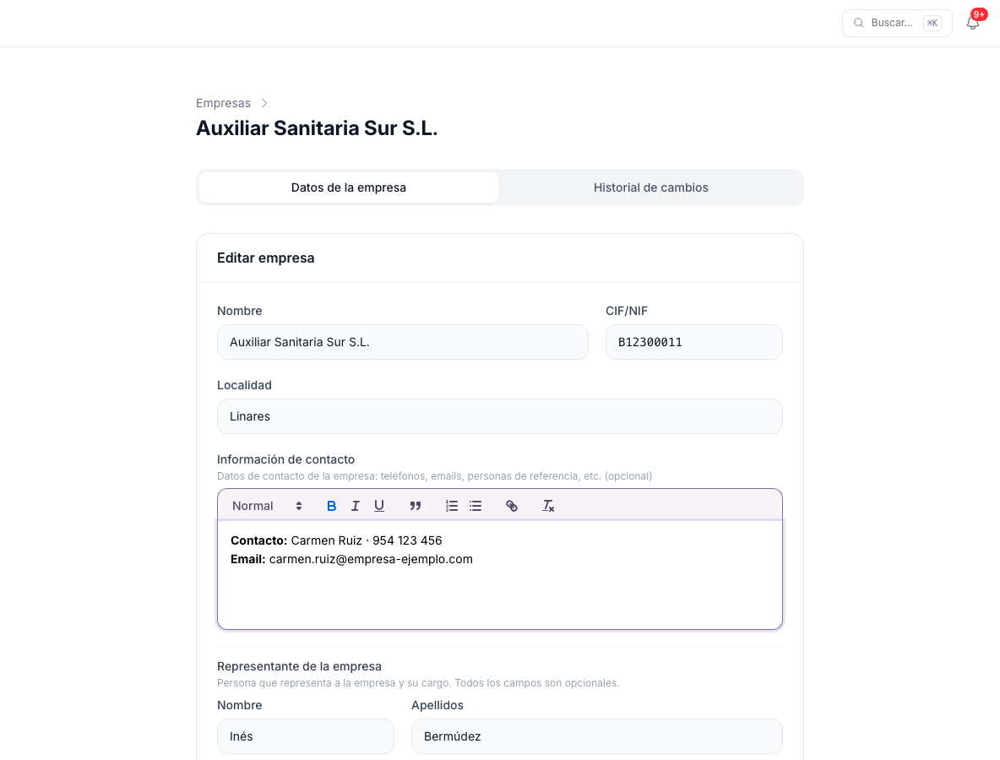

En **Empresas**:

- Alta con **CIF/NIF** y localidad; listado con **exportación a Excel**.
- **Información de contacto** en texto enriquecido (teléfonos, emails, personas de referencia…).
- Cada empresa tiene **centros de trabajo**, **tutores duales** y **docentes de enlace** asignados.
- **Historial de cambios**: quién modificó qué y cuándo, con diff de cada campo.

---

## 7 · Crear una estancia

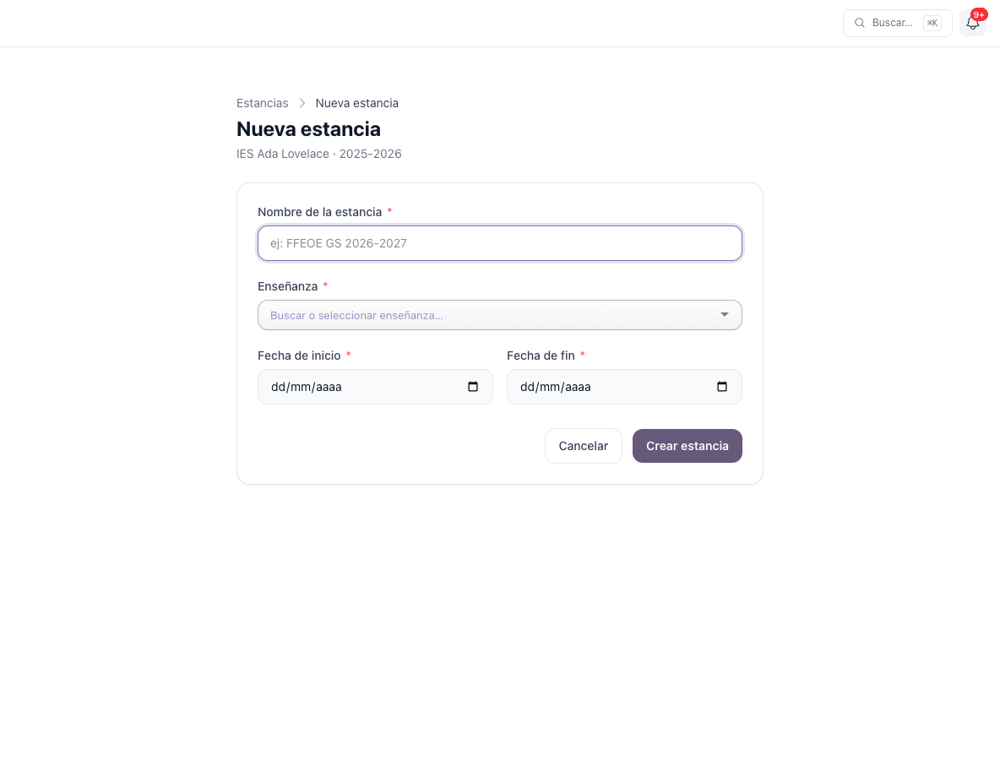

Una **estancia** agrupa los puestos de una enseñanza en un período:

- Se elige la **enseñanza** y las **fechas** (inicio y fin).
- Una misma enseñanza puede tener **varias estancias** que se solapen
  (no todos los grupos hacen la FFEOE a la vez).

> El formulario evita envíos duplicados al pulsar dos veces.

---

## 8 · El listado de estancias

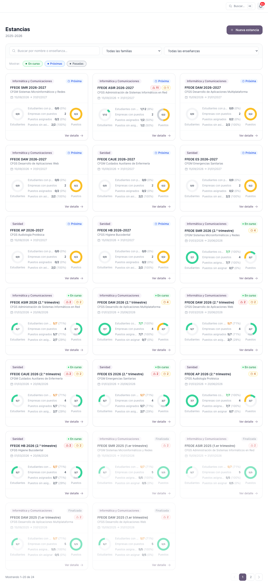

- Tarjetas con **estado de ocupación** (plazas, firmadas) y período.
- Filtros por **familia**, **enseñanza** y búsqueda, **recordados por centro**.
- Indicadores visuales del progreso de cada estancia.
- Pestaña **Firmas pendientes**: lista de puestos registrados en Séneca sin firma,
  ordenados por urgencia (fecha fin más próxima primero).

---

## 9 · Detalle de la estancia: los puestos

<!-- _class: tight -->

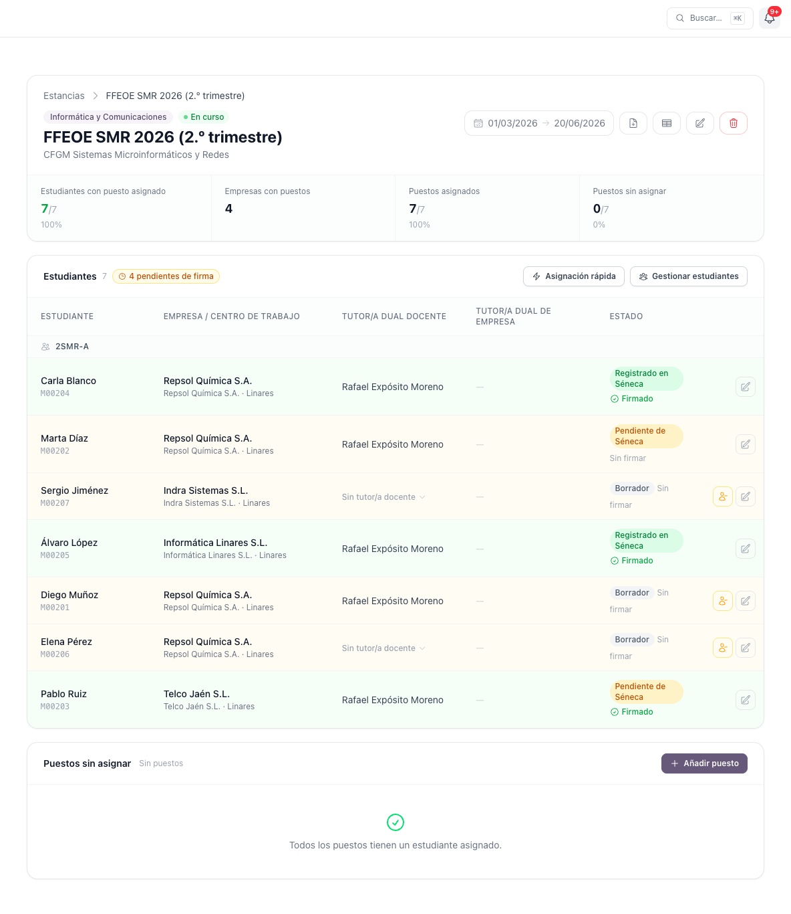

Cada fila es un **puesto formativo**:

- **Estudiante** · **Empresa / centro de trabajo**
- **Tutor dual docente** · **Tutor dual de empresa**
- **Estado** (Borrador, Pendiente, Registrado en Séneca)

Se asignan estudiantes y tutores con un modo de **asignación rápida** (selectores en
todas las filas) y se exporta el **informe PDF** y los puestos a **Excel**.

---

## Trabajo en equipo, en tiempo real

<!-- _class: tight -->

Varias personas (dirección, coordinación, jefatura, enlaces) pueden gestionar
los puestos de una misma estancia **a la vez**:

- La pantalla se **actualiza sola en menos de un segundo**: lo que cambia otra
  persona aparece **sin recargar**, y la fila modificada se **resalta** un instante.
- Cada pantalla muestra siempre **lo que su rol permite ver**: el aviso no transporta
  datos; el contenido se vuelve a pedir al servidor con los permisos de cada usuario.
- Si dos personas editan el mismo puesto, la aplicación **avisa del conflicto**
  en lugar de sobrescribir el trabajo del otro.

> Disponible en los modos **binario nativo**, **Docker** y **Ubuntu Server**, sin configuración adicional.

---

## 10 · Asignar un puesto

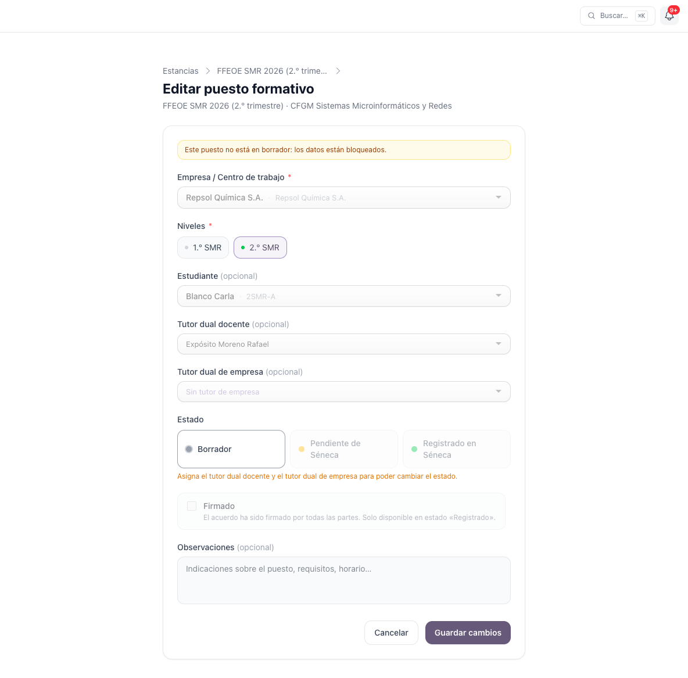

Al **editar un puesto** se define:

- **Empresa / centro de trabajo** y **nivel**
- **Estudiante** (opcional al crearlo)
- **Tutor dual docente** y **tutor dual de empresa**

> El **docente de enlace** de la empresa puede preparar los puestos **antes** de que se asigne estudiante.

---

## 11 · Estados del puesto y firma

<!-- _class: tight -->


Ciclo de vida de cada puesto:

**Borrador** → **Pendiente de Séneca** → **Registrado en Séneca**

- Para salir de *Borrador* hay que asignar **ambos tutores** (docente y de empresa).
- La casilla **Firmado** solo se habilita en *Registrado en Séneca*.
- Se puede volver a *Borrador* para corregir datos.

> La aplicación **bloquea** transiciones inválidas y avisa de lo que falta.

---

## El calendario de estancias

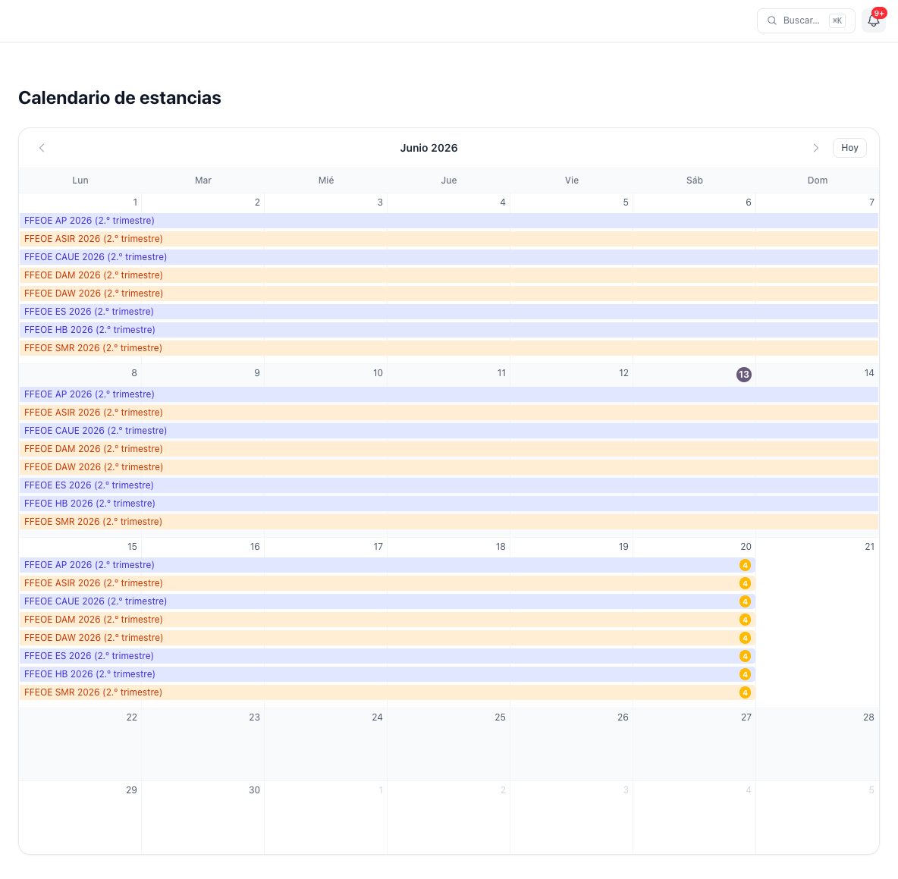

- Vista mensual con cada estancia en su **carril**, un color por **familia profesional**.
- Navegación entre meses sin recargar la página y botón **Hoy**.
- Un **badge ámbar** en cada barra indica los **puestos pendientes de firma**.

---

## Seguimiento: notificaciones y tareas

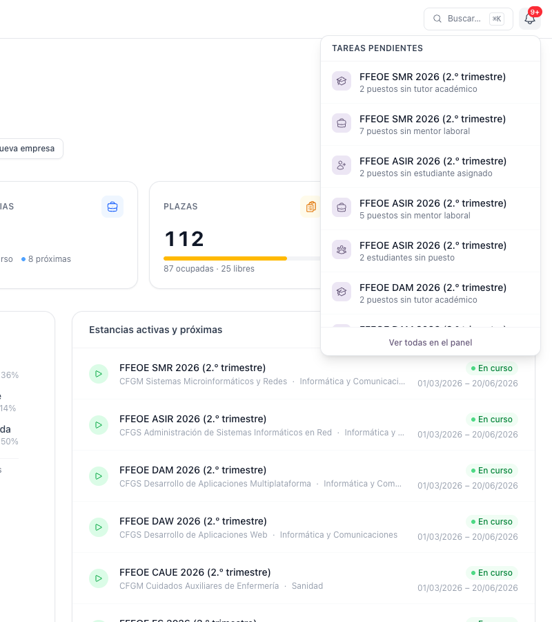

- La **campana** reúne las tareas pendientes del docente: firmas próximas, asignaciones…
- Resalta las firmas dentro de la **ventana de cierre** (próximos días).
- Cada docente solo ve **lo suyo**, en su centro activo.

---

## Búsqueda global ⌘K

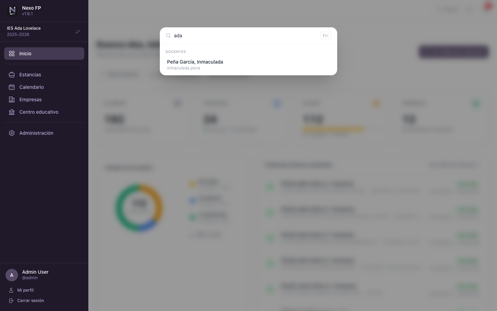

- Atajo **⌘K / Ctrl-K** desde cualquier pantalla.
- Encuentra estancias, empresas, estudiantes y secciones al instante.
- Navegación rápida sin pasar por los menús.

---

## Informes y exportaciones

<!-- _class: tight -->

Nexo FP genera la documentación que se necesita fuera de la aplicación:

- **Informe de estancia** en **PDF**, listo para imprimir o tramitar.
- **Exportación a Excel** de empresas y puestos.
- **Avisos por email** automáticos:
  - al **crear puestos** (a los docentes de enlace de la empresa),
  - al **asignar tutoría docente**,
  - **recordatorio diario de firma** antes de que comience la estancia, al **tutor docente, la coordinación
    y la jefatura de familia** (programado solo; sin cron externo).

> Cada centro y cada docente puede **activar o desactivar** estos avisos en sus ajustes.

---

## Perfil de usuario

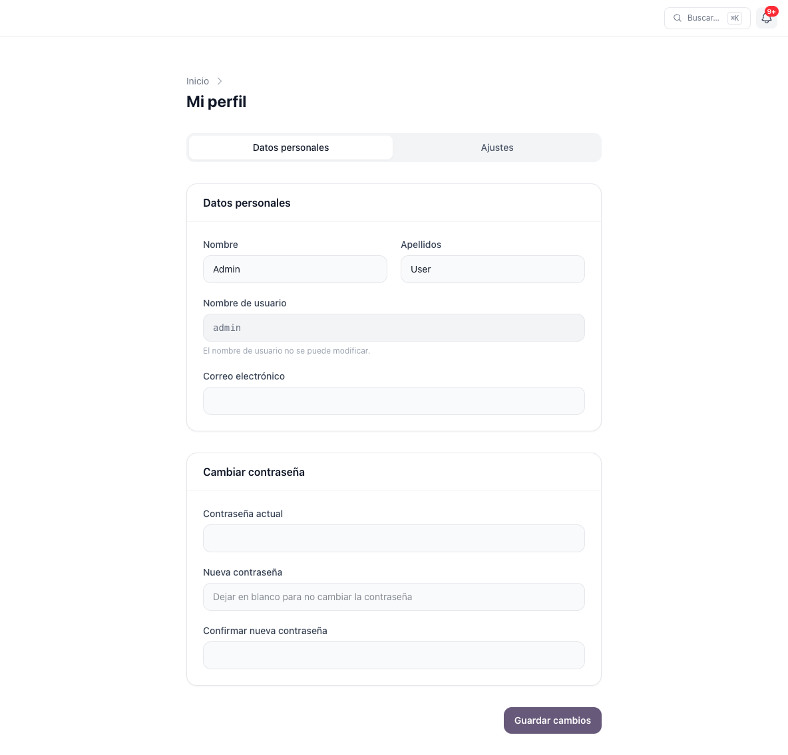

Cada persona gestiona su cuenta en **Mi perfil**:

- Datos personales y **correo electrónico** (con verificación).
- **Cambio de contraseña**; y restablecimiento por email si se olvida.
- Ajustes personales que **sobrescriben** los del centro.

---

<!-- _class: sep -->

# Instalación de la aplicación

## Configuración y despliegue

---

## Cinco formas de desplegar

<!-- _class: tight -->

| Modo | Base de datos | Para quién | Esfuerzo | Tiempo real |
|---|---|---|---|---|
| **Binario** (FrankenPHP) | SQLite | Un centro, "doble clic" | Mínimo | ✅ |
| **Docker Compose** | PostgreSQL | Servidor / producción | Medio | ✅ |
| **Ubuntu Server 26.04** | PostgreSQL | VPS Ubuntu, sin Docker | Medio | ✅ |
| **Plesk** (PHP-FPM) | MySQL / PostgreSQL | VPS con Plesk, sin Docker | Medio | ❌ |
| **Desarrollo local** | PostgreSQL | Contribuir al proyecto | Para técnicos | ✅ |

- El **binario** es un único ejecutable: ideal para un IES sin infraestructura.
- **Docker** y **Ubuntu Server** añaden HTTPS automático y PostgreSQL robusto.
- **Ubuntu Server**: script de instalación automatizado (`install-ubuntu.sh`).
- **Plesk**: para centros con VPS ya gestionado; no requiere Docker.
- En binario, Docker y Ubuntu las **migraciones se aplican solas** al arrancar.

---

## Despliegue binario (lo más sencillo)

<!-- _class: tight -->

En `dist/` hay un lanzador por sistema operativo:

- `start.sh` (Linux/macOS) · `start.ps1` (PowerShell) · `start.bat` (Windows)
- **¿Solo probarlo?** Usa `demo.*` (en Mac, doble clic en `demo.command`): arranca con datos de ejemplo.

Al ejecutarlo:

1. Arranca **FrankenPHP** (servidor de aplicaciones autocontenido).
2. Usa **SQLite** como base de datos (un solo fichero, fácil de copiar).
3. Aplica migraciones y deja la aplicación lista en el navegador.
4. Lanza en segundo plano el **worker** (envío asíncrono de correos y recordatorio diario programado).

> Copiar el fichero de base de datos = copia de seguridad completa.

---

## Despliegue con Docker Compose

<!-- _class: tight -->

```bash
cp .env.example .env.local            # define APP_SECRET y DB_PASSWORD
export COMPOSE_ENV_FILES=.env.local   # Compose usará .env.local
docker compose up -d
```

La primera vez, el contenedor automáticamente:

1. Aplica las **migraciones**.
2. Crea el admin inicial (`admin` / `admin`) y el centro `IES Test`.
3. Precalienta la caché.

- Base de datos **PostgreSQL 16**.
- **Caddy + Let's Encrypt**: HTTPS automático con tu dominio.
- Disponible en `http://localhost` (o tu dominio en producción).

---

## Despliegue en Ubuntu Server 26.04

<!-- _class: tight -->

Para centros con **VPS propio** en Ubuntu 26.04 LTS: HTTPS automático, sin Docker.
Necesita acceso SSH con sudo y un **dominio** que apunte al servidor.

```bash
sudo bash install-ubuntu.sh
```

El script solicita el **dominio**, la **contraseña de base de datos** y el **remitente de
correo** y se encarga de todo:

1. Instala y configura **PostgreSQL**.
2. Abre el cortafuegos (puertos 80 y 443).
3. Instala FrankenPHP como servicio del sistema (HTTPS automático con Let's Encrypt).
4. Lanza el **worker** como servicio independiente (correos y recordatorio de firma).

> Las migraciones y el admin inicial (`admin` / `admin`) se crean solos al arrancar.

---

## Despliegue en Plesk

<!-- _class: tight -->

Para centros con **VPS ya gestionado con Plesk**: sin Docker ni FrankenPHP.

1. Clona el repositorio (o sube el código fuente) en el servidor.
2. En Plesk: cambia el **directorio raíz del dominio** a la carpeta `public/` del proyecto.
3. Configura **PHP 8.4 FPM** con las extensiones requeridas.
4. Crea `.env.local` con `APP_SECRET`, `DATABASE_URL` y `MIGRATIONS_PATH=migrations/mysql`.
5. Por SSH: `composer install --no-dev` y `php bin/console doctrine:migrations:migrate`.
6. En **Tareas programadas**: lanza el worker **cada hora** para correos y recordatorios.

> La sincronización en tiempo real no está disponible en este modo; la aplicación funciona con normalidad.

---

## Configuración por variables de entorno

<!-- _class: tight -->

| Variable | Para qué |
|---|---|
| `APP_SECRET` | Clave de seguridad (64 hex aleatorios) |
| `DATABASE_URL` | Conexión a la base de datos |
| `MAILER_DSN` | Servidor SMTP para los emails |
| `MAILER_FROM` | Remitente de los correos automáticos |
| `DEFAULT_URI` | URL pública (enlaces de los emails) |
| `MESSENGER_TRANSPORT_DSN` | Cola de envío asíncrono de correos |
| `APP_EXTERNAL_*` | Integración con **Séneca** (Junta de Andalucía) |

> Con `APP_EXTERNAL_ENABLED` el profesorado puede autenticarse con sus credenciales de Séneca.

---

<!-- _class: tight -->

## Puesta en marcha y ajustes

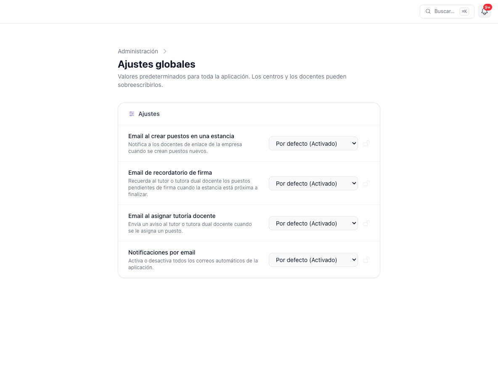

Comandos de consola:

- `app:setup` — admin inicial + centro de prueba (primer arranque).
- `app:create-admin` — crear administradores.
- `app:create-educational-centre` — alta de centros.
- `app:send-reminders` — recordatorio de firma (automático; el comando es para uso manual).

**Ajustes jerárquicos**: Global → Centro → Docente. Cada nivel puede
**bloquear** un valor o dejar que el inferior lo cambie.

---

## Operación del día a día

<!-- _class: tight -->

- **Copias de seguridad**: SQLite = un fichero; PostgreSQL = `pg_dump`.
- **Correos en cola** (Messenger): si un envío falla, se reintenta y, si no,
  queda registrado para revisarlo:
  ```bash
  php bin/console messenger:failed:show
  php bin/console messenger:failed:retry
  php bin/console messenger:failed:remove <id>
  ```
- **Recordatorio de firma** automático cada día, sin cron externo.

> El envío asíncrono mantiene la aplicación **rápida**: el usuario no espera al correo.

---

## Registro de actividad

<!-- _class: tight -->

**Auditoría completa** de lo que ocurre en la plataforma — accesible desde Administración.

| Se registra | Ejemplos |
|---|---|
| 🔐 Sesión | Inicio/cierre de sesión, suplantación de usuario |
| ✏️ Escrituras | Crear estancias, editar estudiantes, importar docentes… |
| 📥 Exportaciones | Descargas a Excel o JSON |

Cada entrada incluye: **fecha/hora exacta · IP del usuario · usuario activo · usuario real**
(si hay suplantación) · **centro y curso** afectados · datos adicionales de la acción.

**Filtros en tiempo real**: rango temporal con accesos rápidos, búsqueda de usuario
con autocompletar, centro, curso académico y tipo de acción.

- Retención configurable (90 días por defecto); limpieza **automática** semanal.
- **Activable/desactivable** con `APP_LOG=true/false` (desactivado por defecto en el binario nativo).

---

## En resumen

<!-- _class: tight -->

**Nexo FP** convierte la gestión de la FFEOE en un flujo claro y compartido:

1. **Un único sitio** para estudiantes, empresas, tutores, estados y firmas.
2. **Cada rol ve y hace lo justo**, con permisos derivados de los datos reales del centro.
3. **Se despliega como quieras**: desde un doble clic hasta un servidor con HTTPS.

> Menos hojas de cálculo, menos correos sueltos. Más control y trazabilidad.

---

## Un proyecto REASOL

<!-- _class: tight -->

Nexo FP forma parte del **proyecto de innovación educativa REASOL**
(**PIN-219/23** y **PIN-354/24**), financiado por la **Consejería de Desarrollo
Educativo y Formación Profesional** de la **Junta de Andalucía**.

- REASOL impulsa soluciones abiertas para la gestión de la Formación Profesional.
- Nexo FP se publica como **software libre** bajo licencia **AGPL-3.0**.
- El código y la documentación están disponibles para cualquier centro que quiera
  adoptarlo o adaptarlo.

> Una herramienta hecha por y para el profesorado de FP, con financiación pública
> y resultados abiertos.

---

<!-- _class: lead -->

# Gracias

**Recursos**

Manual en línea: **reasol-edu.github.io/nexo-fp**
Descargas y versiones: **github.com/reasol-edu/nexo-fp/releases**
Repositorio: **github.com/reasol-edu/nexo-fp**

*¿Preguntas?*
